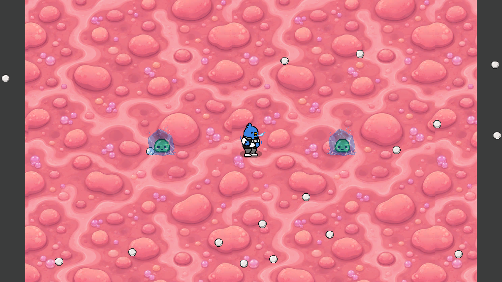
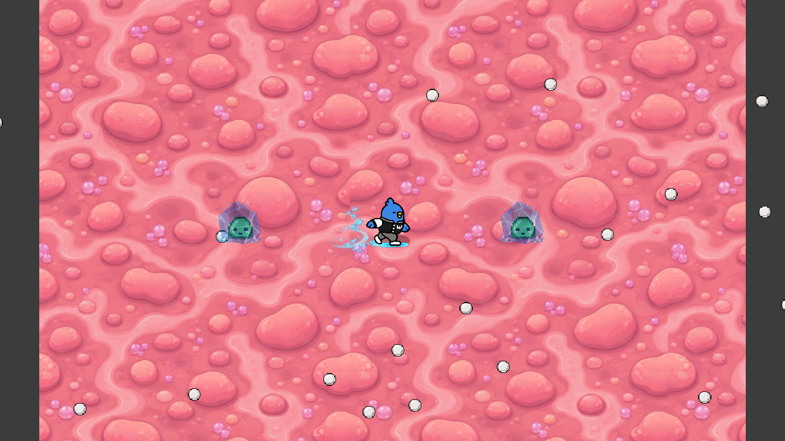
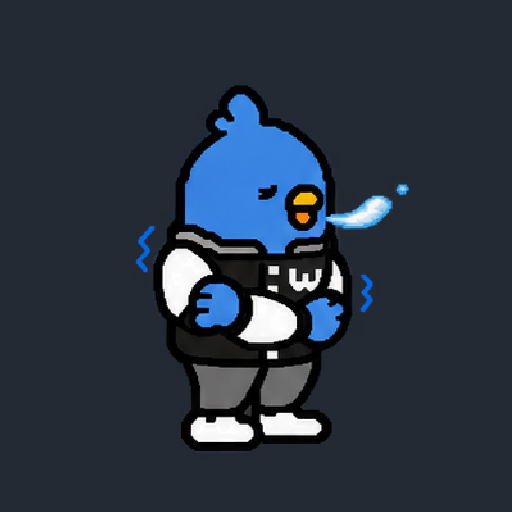
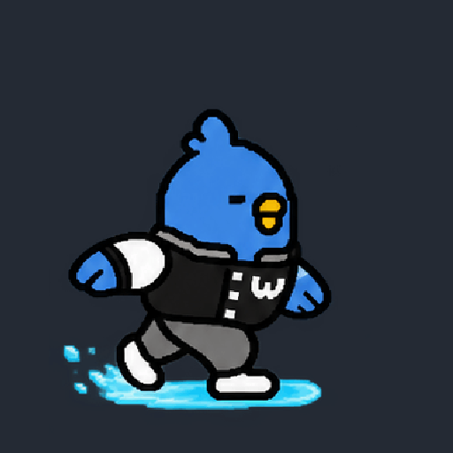

# 혁이 얼음 리메이크 · 2026-09-25

## 패시브 「하다보면」

- 빙결침 기본 보유 유지. 기본 즉시 빙결 확률을 기존 코드 5%에서 요청한 10%로 통일했다(다른 캐릭터의 기본 빙결침도 10%).
- 살아 있는 적에게 빙결침 효과를 적용할 때 즉시 빙결을 추첨한다. 혁이는 실패마다 +1%p, 최대 100%. 성공하면 10%로 초기화한다.
- 실패 횟수는 적별이 아니라 혁이 본인에게 누적한다. 4번째 적중도 즉시 빙결 추첨은 수행한다. 추첨에 실패했어도 적별 냉기 4스택은 확정 빙결을 일으키며, 실패 누적은 유지한다.
- 액티브 빙결은 확률을 늘리거나 초기화하지 않는다. 이미 빙결된 적에 대한 무효 상태 적용, 사망한 대상은 추첨하지 않는다. 실제 쇄빙 후 다음 상태 적용은 새 추첨이다.
- 빙결 최대 5초, 다음 빙결침 쇄빙 +20%, 보스 감속 저항 유지. 눈보라 적용 시점 1.65초 유지.
- HUD에는 현재 즉시 빙결 확률을 표시한다. 씬 이동 스냅샷에 실패 횟수를 별도 저장한다. 구 수면 저장값은 무시하며 새 필드는 구 저장에서 0이다.
- 이전 수면 스택·회전 수정·수면 소비 이동속도 버프는 폐기한다. 다른 캐릭터에게 누적 효과를 적용하지 않는다.

## 모션과 이미지

- `Hyuki_ColdIdle.png`: 8프레임. 팔을 교차해 몸을 감싸고 추워한다. 작은 상체 떨림, 벌어진 부리, 구가 아닌 흐트러지는 입김. 하단 160픽셀의 다리·발은 모든 프레임에서 바이트 단위로 동일하다.
- `Hyuki_IceDash.png`: 승인한 빙판 보드 슬라이드 8프레임. 기존 이동 방향·대쉬 지속시간을 유지한다.
- `HyukiHadaBomyeon.png`: 옆으로 누워 한 날개로 머리를 괴고 다리를 꼬며 다른 날개로 빙결침을 툭 튕기는 아이콘.
- 기존 걷기와 같은 PPU 600.8475, 공통 발바닥 높이·피벗 사용. 원본 걷기의 머리 폭을 기준으로 종횡비를 유지한 크기 정렬. 입김·얼음 꼬리를 캐릭터 크기로 잘못 계산하지 않는다. 자세에 따른 웅크림은 유지한다.
- 게임에는 투명 PNG를 연결한다. GIF 배경은 검수용이다. Transform 배율·HP·피격 판정 변경 없음.
- `Hyuki_Idle.png`, `Hyuki_Dash.png`, `HyukiPassive.png`는 삭제·덮어쓰기하지 않았다. 추후 스킨 원본이며 현재 기본 모션에서는 연결 해제했다. 스킨 선택 기능을 새로 구현한 것은 아니다.
- 설명창/결과 화면의 대기 시퀀스도 새 대기로 연결. 걷기·프로필·포획 외형 유지.

## 제작 방법 / 최종 프롬프트 요약

내장 image_gen으로 생성·수정 후 투명 분리, 균일 비율 리사이즈·프레임 배치·하체 고정·GIF 패키징.

1. 대기: “Preserve Hyuki identity, proportions, jacket, crossed self-hugging arms and blue shiver marks. Eight frames, fixed planted feet, tiny upper torso shivers; slightly open chattering beak and wispy tapered translucent breath instead of a sphere. Transparent background.”
2. 대쉬: 승인 빙판 시트의 자세·색·윤곽을 보존하고 배경만 투명 분리. 8프레임으로 슬라이드 후 기본 자세 복귀.
3. 아이콘: “Hyuki reclining sideways, head supported by one wing, legs crossed; free wing casually flicks one silver gold-ring ice needle. Pixel art, clear silhouette, icy blue square composition, no text or rarity border.”

## 검증 방법

- Unity 2022.3.62f3 Windows Development 빌드.
- `-hyukiRemakeSmoke`: 이름·아이콘·시작 침·8프레임·PPU·피벗·수면 제거·실패 증가·4스택 분리·즉시 성공 초기화·대상 간 공유·복원·확률 상한·일시정지·대쉬 외형·HP/판정·다른 캐릭터 분리.
- `-hyukiTimingSmoke`: 기존 눈보라 1.65초·실제 적용 후 5초·복원·취소 회귀.
- `-shiniSkillsSmoke`, `-ariSkillsSmoke`, `-ashiSkillsSmoke`: 타 캐릭터 회귀. 구 수면 검사는 새 폐기 동작 검사로 갱신.
- 모바일 실기기 검증은 이번 작업에서 수행하지 않는다.

## 최종 검증 결과

- Unity 2022.3.62f3 Windows Development 빌드 성공, 오류 0.
- 최종 빌드 실행: 리메이크 33, 혁이 타이밍 147, 신이 58, 아리 54, 아시 12 = 304항목 통과(기존 반복 셰이더 검사 포함). 다섯 실행 모두 종료 코드 0.
- Editor Play 30항목 통과: R키, 스킬 버튼, TAB 일시정지, 빙결 지연·만료·쇄빙, 사망 정리 포함.
- 실제 게임 카메라 렌더로 대기·대쉬 적용 화면 확인. 아래 캡처는 HUD를 제외한 월드 카메라 화면이며 GIF는 소재 미리보기다.
- 하체 픽셀 동일성·공통 PPU/피벗·대쉬 전후 Transform/HP/피격 콜라이더 유지 확인. 휴대폰 실기기는 미검증.

### 소재 미리보기

