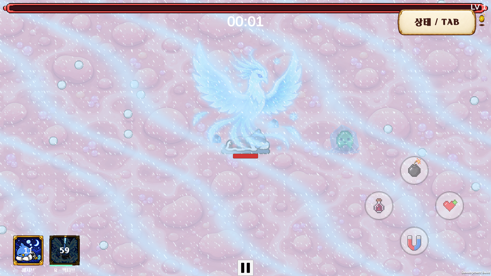
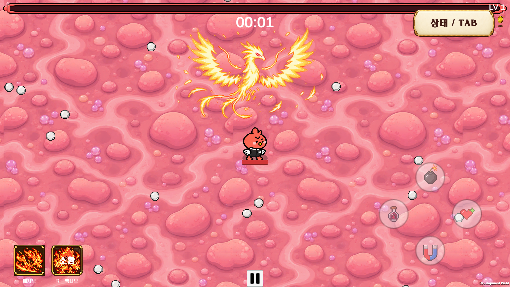
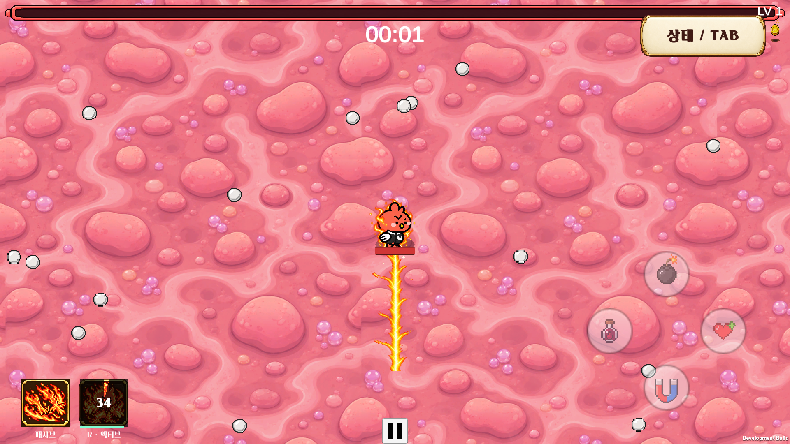

# 혁이·신이 봉황 스킬 업데이트

> 2026-09-25 혁이 최신 기준: [얼음 리메이크](Hyuki-Ice-Remake.md). 수면 패시브는 「하다보면」(즉시 빙결 10%, 실패마다 +1%p)으로 교체했고 대기·대쉬·아이콘도 변경했다. 아래 수면 관련 내용과 옛 검증 수치는 당시 이력이다.

## 확정 동작

- 빙결침과 혁이 액티브의 빙결 최대 유지시간은 모두 **5초**. `IceSkillRules.FreezeDuration`을 공유한다. 기존 다음 빙결침 적중 시 쇄빙(+20% 피해)과 해제 후 재빙결 대기 2초는 유지한다. 보스는 기존 규칙대로 완전 정지 대신 20% 감속한다.
- 혁이: 빙결침 기본 보유. 「자는 동안에도 천재」는 대기 1초당 수면 1스택, 5스택당 회전 수정 1개. 대기를 끝내면 전부 소모하여 4초 동안 스택당 이동속도 +8%. 발사체 수·공격속도·발사체 속도에는 영향을 주지 않는다.
- 혁이 「잠깐 진심」(2026-09-23 갱신): 입력 1.65초 뒤 눈보라가 잦아들기 시작할 때 현재 거리 4 이내 대상에게 빙결 적용, 쿨타임 60초. 빙결 5초는 실제 적용 순간부터 센다. 얼음 봉황의 16개 포즈를 보간하고 화면 오른쪽 아래로 눈보라가 흐른다. 눈보라는 같은 방향으로 이동하면서 잦아든다. 빙결 수정은 원본 몬스터 크기에 맞추며 알파 0.43으로 내부가 보인다.
- 신이 「불닭의 끝」: **3초 봉황 소환·흡수 연출 완료 → 기존 불닭 활성화 이미지 시작 → 이 시점부터 활성화 15초·쿨타임 35초 시작**. 소환 중 중복 발동 불가. 소환 도중에는 원본 신이 모습, 종료 후 기존 불닭 대기·걷기·대쉬 프레임을 그대로 사용한다. 소환 중 일반 이동에는 활성화 불꽃길을 만들지 않으며, 대쉬 패시브는 기존대로 작동한다.
- 신이 세로 불꽃길은 별도 세로 아트와 연속 UV/경로 메쉬를 사용한다. 상하 방향 전환 시 경로를 분리하고, 기존 가로·대각선 방식은 유지한다. 각 구간 수명 3초, 발 위치 기준, 화염침과 화상 중첩/틱 피해 공유는 유지한다.
- 모든 연출은 인게임에서 진행된다. 캐릭터 자체의 원본 크기와 프레임은 별도로 유지하며 캐릭터 이미지를 봉황 이미지에 합치지 않는다.

## UI·저장·입력

- 출전 준비/프로필/TAB의 기존 패시브·액티브 두 칸에 혁이 아이콘 연결. 메인 시작 화면에는 스킬 아이콘을 추가하지 않는다.
- 인게임 왼쪽 아래 아이콘: 수면 스택 수, 남은 버프 시간, 액티브 쿨타임과 기존 부채꼴 가림 표시. 신이 소환 중에는 `소환` 표시.
- R 및 모바일 기존 스킬 버튼을 동일 런타임에 연결. TAB/일시정지 시 시전·빙결·쿨타임·이펙트 시간도 멈춘다.
- 장면 이동 시 수면 스택, 소비 스택의 버프, 신이 시전 잔여시간과 활성화/쿨타임 복구. 사망/비활성화 시 상태와 연출 정리.

## 아트

`Assets/Junhan/Art/PhoenixSkills/`: HyukiPassive, HyukiActive(뒤쪽 얼음 봉황 추가), IcePhoenix(4×4), FirePhoenix(4×4), VerticalFire(4×1), IcePrison(4×2).

생성 방식은 내장 image_gen. 최종 프롬프트는 `PhoenixSkills-ArtPrompts.json`. 원본 파일을 보관하며 불꽃 아트의 배경은 셰이더에서 제외한다. `PhoenixSkillInstaller.Run`은 아이콘/시트를 가져와 캐릭터 정의에 연결한다.

## 검증 방법

- `PhoenixSkillPlayTests.Run`: 혁이 기본 침, 5·10스택 수정, 이동 보너스/만료/장면 복구, R/터치, 5초 빙결과 범위, 쇄빙, TAB 일시정지, 사망·풀링 정리, 실제 화면 캡처.
- `ShiniSkillPlayTests.Run`: 봉황 완료 전 활성화/쿨타임 대기, 시전 저장/복구와 TAB 일시정지, 기존 불닭 이미지 전환, 불꽃길과 화상 중첩 회귀 검증.
- `AshiSkillPlayTests.Run`: 아시 기존 스킬/UI 회귀 검증.
- EditMode 전체 테스트 및 Windows Development 빌드.
- 실행 파일 `-phoenixSkillsSmoke`: 두 캐릭터 봉황 연출, 셰이더, 5초 빙결, 세로 불꽃길 실제 경로 연결 확인 및 캡처. `-shiniSkillsSmoke`는 기존 신이 경로/변신 검증.

## 검증 결과 (2026-09-22)

- 혁이 Play 검증 29개, 신이 Play 검증 44개, 아시 회귀 검증 51개 통과.
- EditMode 전체 51/51 통과.
- Windows Development 빌드 성공, 빌드 오류 0.
- Windows 실행 파일에서 봉황 셰이더, 빙결 5초 유지/해제, 신이 소환 후 타이머 시작, 실제 세로 이동의 불꽃길 좌표·UV 연속성 통과.
- 모바일은 기존 스킬 버튼 경로 및 HUD 배치를 검증했다. 별도 실기기 빌드는 이 변경에서 수행하지 않았다.
- 실행 테스트의 무타격 빙결 검증은 기존 발사체를 정리한 상태에서 수행한다. 별도 Play 검증에서 다음 침 적중 시 쇄빙이 유지됨을 확인했다.

### 실제 실행 화면

