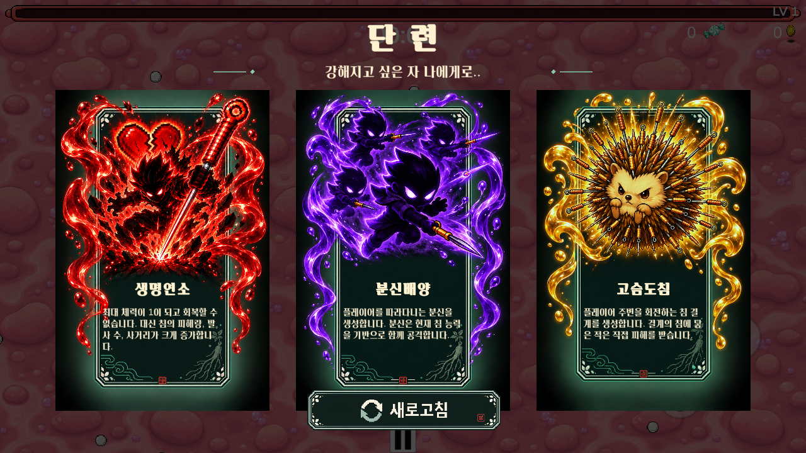
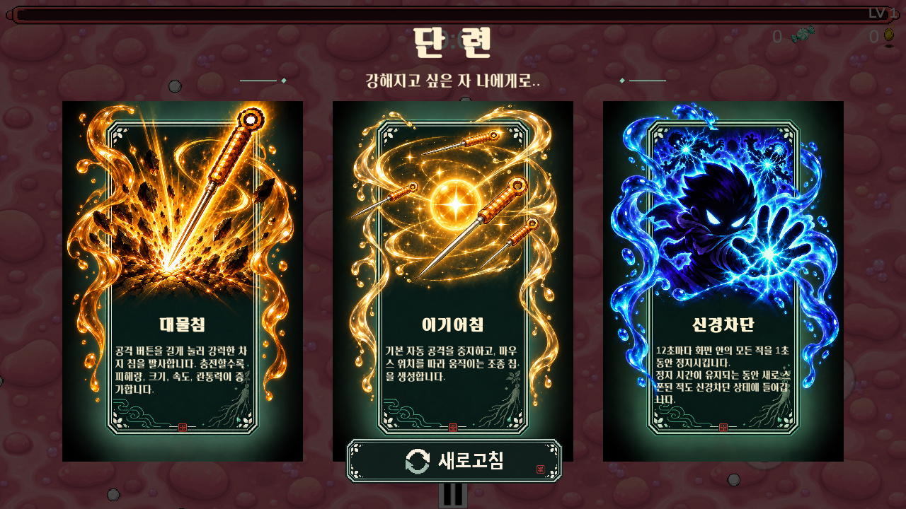
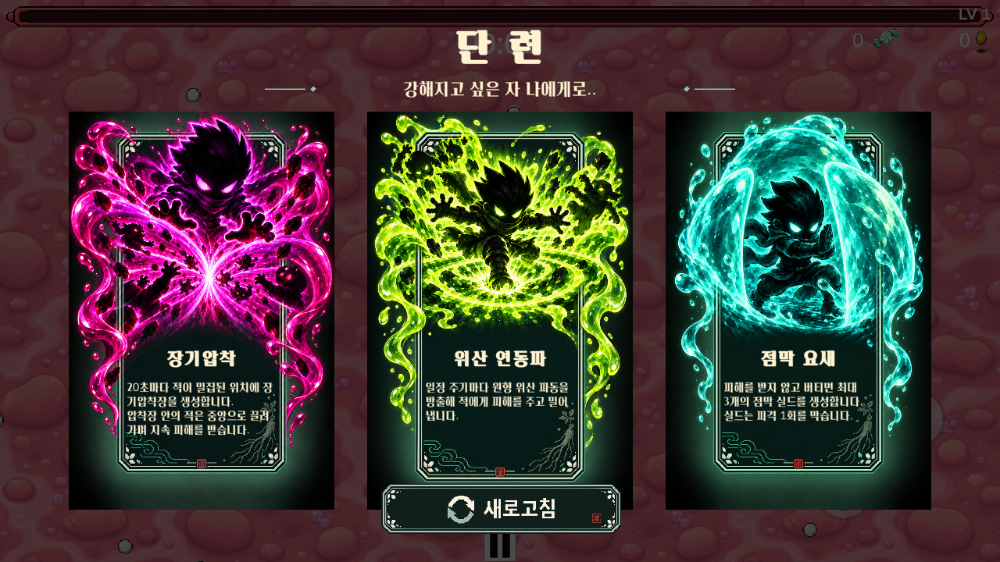
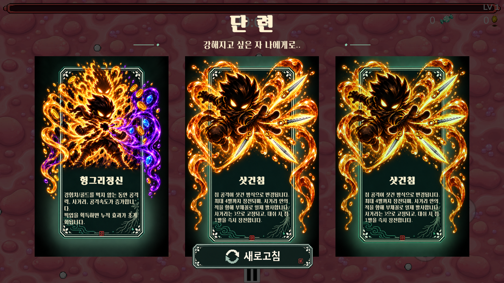

# 단 련 — 증강 선택 패널 (2026-10-01)

승인된 자개·인삼 카드 PNG를 실제 Level 1 증강 선택창에 적용했다. 제목은 **단 련**, 안내는 **강해지고 싶은 자 나에게로..**다. 실제 아이콘·이름·효과·수치·진행도는 게임 데이터로 표시한다.

## 아트와 표시 규칙

- `Assets/Resources/AugmentPanels`: Common(평범/회색), Rare(희귀/파랑), Epic(영웅/보라), Legendary(강화 전설/주황·금색), Supreme(지존/검붉은색), Original(오리지널/옥색·낙관), Reroll(새로고침).
- 2026-10-01 생성한 승인 PNG 원본 6개를 그대로 포함한다. 카드와 버튼의 여백은 `AugmentPanelImporter`가 스프라이트 영역으로 잘라 쓰며 원본 픽셀은 수정하지 않는다.
- 모든 신규 카드 안쪽은 같은 어두운 색 계열이다. 등급별 이미지를 직접 교체하며 카드 전체를 등급색으로 물들이지 않는다. 불투명 받침으로 캐릭터가 카드 안에 비치지 않게 한다.
- 최초 특수증강 획득은 회색 프레임에 `특수` 배지를 표시한다. 수치 강화와 오리지널은 실제 등급 배지를 표시한다. 반복되는 제목 접두사·등급 설명만 화면에서 정리하며 효과 수치와 진행도는 유지한다.
- **강화 전설**은 이전 지존의 주황·금색 프레임을 사용한다. **지존**은 동일한 원본에서 테두리·발광·장식 색만 검붉게 변경한 신규 PNG를 사용한다.
- 새로운 기믹을 주는 기존 전설증강은 **고귀 증강**이다. 현재 고귀 11종은 승인된 오리지널 계열 액자·액체 오버프레임 카드를 사용한다. 독 전염은 후보에서 제외했다. 저장 데이터 호환을 위해 내부 `LegendaryAbility`/`AugmentTier.Legendary` 식별자는 유지하며, 강화 등급 `AugmentUpgradeGrade.Legendary`와 별개로 판정한다.
- 새로고침 이미지에는 글자가 포함돼 있어 기존 TMP 글자는 중복 표시하지 않는다. 사용한 버튼은 회색으로 표시하며 1회 사용 제한을 유지한다.

## 동작과 배치

- 검정 70% 반투명 배경, 카드 3장, 하단 새로고침. 카드 전체를 눌러 선택한다.
- 특수·수치·오리지널 카드의 아이콘·설명은 실제 UI다. 고귀는 승인된 아이콘과 액체 효과를 정지 합성 이미지로 사용하고, 이름·효과 설명은 게임 텍스트로 표시한다.
- 1280×720 기준 배치를 안전 영역에 맞춰 비율 축소한다. 검정 배경은 안전 영역 밖까지 전체 화면을 덮는다.
- 제목·카드·새로고침은 같은 배율로 조절한다. 등장 애니메이션은 일시정지 중에도 재생된다.
- 기존 보상 추첨, 수치, 처방전 보상 경로, 새로고침 규칙을 유지한다. 닫힌 카드의 중복 선택은 무시한다.

## 최초 패널 적용 검증

- Unity 2022.3.62f3 EditMode 기존 테스트 68/68 통과.
- 실제 Level 1의 `AugmentPanelPlaySmoke`: 최종 269개 검사 통과, Error/Exception/Assert 없음.
- 21종 특수증강 최초 획득 설명, 63개 오리지널 설명, 12종 전설 설명의 글자 영역 검사.
- 5개 프레임, 실제 아이콘, 3장 선택, 첫 선택의 실제 보상 적용, 새로고침 1회 제한 및 재개방 초기화, 전설 보상 선택 검증.
- 1280×720, 1024×768, 1560×720에서 카드 간격·화면 경계·포인터/터치 레이캐스트·새로고침 위치 검사.
- Windows x64 Development 빌드 성공, 오류 0. 결과: `Builds/ApothecaryPlayer/24tu.exe` (빌드 파일은 Git 제외).
- 위 캡처는 실제 추첨 풀에서 얻은 희귀·영웅·오리지널 보상으로 촬영했다. 무작위 추첨 때문에 실제 플레이에서 같은 조합이 보장되지는 않는다.
- 자동 UI 검증이며 실제 Android/iPhone 기기 검증이나 장시간 수동 QA를 의미하지 않는다.

실행 명령: Unity `-batchmode -projectPath <repo> -executeMethod Vampire.Tests.Editor.AugmentPanelPlaySmoke.Run -logFile <log>`. 그림 확인이 필요하므로 이 검사에서는 `-nographics`를 사용하지 않는다. 테스트는 장면에 임시 상태를 만들며 저장하지 않는다.

검증 로그: `augment-panel-editmode.xml`, `augment-panel-play-complete.log`, `augment-panel-windows-build.log` (Codex 작업 폴더). 기존 MapPanelRoot/MapViewport의 누락 스크립트 경고는 이번 UI 작업 범위 밖이다.

## 비전서·플랫폼 HUD 후속 변경

- PC HUD의 상태/TAB·설정/ESC 버튼은 숨긴다. 키보드 TAB·ESC 동작은 유지한다. 모바일에서는 상태·설정 터치 버튼을 제공하며 조준 스틱·혈전 과충전 버튼과 겹치지 않도록 배치한다.
- 비전서는 화면 우측 안전 영역 끝에 붙는 앤틱 동양풍 두루마리다. 기본은 말린 상태이며 클릭 시 0.28초 동안 아래로 펼쳐진다. 경험치 바와 상단 재화 표시에 겹치지 않도록 아래로 배치한다.
- 종이의 크기와 글자 크기를 늘였다 줄이지 않고, 마스크와 움직이는 아래쪽 봉으로 펼침을 표현한다. 접힌 목록은 렌더링·입력을 차단한다. 접기/상태창 전환 중 목표와 완료 취소선은 유지한다.
- 지정 태그의 목표 3개를 완료하면 **고귀 증강 선택** 버튼으로 기존 기믹 보상 3개 중 하나를 받는다. 보상 선택 중 HUD 숨김 및 중복 수령 방지를 유지한다.
- 신규 그림은 built-in `image_gen`으로 제작했다. 원본 PNG는 `Assets/Resources/AugmentPanels/Supreme.png`, `Assets/Resources/PrescriptionScroll/Rolled.png`, `Assets/Resources/PrescriptionScroll/Open.png`. 주황·금색 원본은 `Assets/Resources/AugmentPanels/Legendary.png`에 보존했다. 실제 사용한 프롬프트는 [scroll-art-prompts.json](scroll-art-prompts.json)에 기록했다.

### 후속 변경 검증

- `ScrollHudPlaySmoke`: 102개 검사 통과. PC 버튼 미표시, 실제 TAB/ESC 키 이벤트, 모바일 표시 분기 및 버튼 동작, 기본 접힘, 일시정지 중 펼침 애니메이션, 세 태그의 퀘스트 설명, 완료 취소선과 진행도 유지, 세 화면 비율의 우측 고정, 고귀 보상 명칭·중복 수령 방지, 강화 전설/지존 프레임 분리를 확인했다.
- `AugmentPanelPlaySmoke`: 269개 검사 재통과. 강화 전설까지 포함한 6개 프레임과 전체 특수·오리지널·고귀 설명 및 선택/새로고침을 확인했다.
- EditMode: 68/68 통과. 모바일은 PC에서 표시 분기를 모의 검사했으며 실제 Android/iPhone 기기 검증은 아니다.
- Windows x64 Development 빌드 재검증 성공, 오류 0. 결과: `Builds/ApothecaryPlayer/24tu.exe` (별도 검증 작업 폴더, Git 제외).
- 후속 로그: `scroll-hud-play-v3.log`, `scroll-augment-regression.log`, `scroll-editmode.xml`, `scroll-windows-build.log`.

[말린 비전서](scroll-rolled-preview.png) · [펼친 비전서](scroll-open-preview.png) · [강화 등급 색상 비교](upgrade-grades-preview.png)

비전서 캡처는 실제 Level 1 화면이다. 등급 비교 캡처는 세 패널을 비교하기 위한 테스트용 후보를 표시했다.

## 고귀 오버프레임 · 카메라 후속 적용 (2026-10-01)

- `Assets/Resources/NoblePanels`에 고귀 11종 정지 카드 적용. 기존 오리지널의 어두운 배경·옥색 액자와 액체 효과를 유지하고, 캐릭터 앞에 겹치던 상단 중앙 낙관·가로획을 제거했다. 하단 장식은 유지한다.
- 그림에 구워진 등급명·이름을 제거했다. 게임에서 이름을 동일 위치·24pt로 표시한다. 카드 설명은 실제 효과만 표시하며 비전서 보상·강화 불가의 반복 안내는 생략한다.
- 아이콘·무기·액체 효과가 프레임 바깥으로 나오도록 전체 PNG를 사용한다. 별도 아이콘·아이콘 마스크·등급 배지를 겹쳐 그리지 않는다. 헝그리정신은 상단 수호령과 주변 효과가 잘리지 않게 여백을 확보했다.
- 현재는 움직이지 않는 합성 이미지다. 향후 아이콘 애니메이션은 액자·아이콘·전경 효과의 별도 레이어 제작이 필요하다. [제작 프롬프트](noble-art-prompts.json).
- **독 전염**은 `AvailableAsNoble` 및 `RequirementsMet`에서 신규 후보를 차단한다. 기존 enum ID·프리팹·동작을 보존하며, 일반 독침은 계속 사용한다. 새 분류로의 재도입은 추후 기획이다.
- Level 1의 직교 카메라 반폭 `width`를 5 → 6.25로 변경했다. 같은 화면에서 월드 대상의 투영 크기가 이전의 **0.8배**, 보이는 가로·세로 범위는 **1.25배**다. 캐릭터·몬스터의 실제 크기·충돌 판정·UI 크기는 바꾸지 않았다.

갤러리는 전체 자산 검수용 고정 후보이며 마지막 샷건침 중복은 마지막 3칸을 채우는 테스트 표시다. 실제 보상 추첨에서 중복 지급을 추가한 것이 아니다.

[카메라 이전](camera-before.png) · [카메라 변경 후](camera-after.png)

### 이번 검증

- `AugmentPanelPlaySmoke`: **401개** 통과. 11종 자산 대응·동일 제목 크기/위치·설명 영역·고귀 배지/중복 아이콘 제거·독 전염 후보 제외·40회 추첨·고귀 선택·일반 카드 재사용 복원·화면 비율별 경계와 입력·카메라 투영 크기 0.8배 검증.
- `ScrollHudPlaySmoke`: **102개** 재통과. 비전서에서 새 고귀 패널 호출·선택·중복 수령 방지와 기존 PC/모바일 HUD 분기 유지.
- EditMode **68/68**, Windows x64 Development 빌드 **성공·오류 0**.
- 1280×720, 1024×768, 1560×720 자동 화면 확인. Android/iPhone 실기기 및 장시간 자연 플레이는 별도 QA 대상이다.
- 검증 로그: `noble-panels-play-final.log`, `noble-scroll-play.log`, `noble-editmode.xml`, `noble-windows-build.log` (Codex 작업 폴더).
