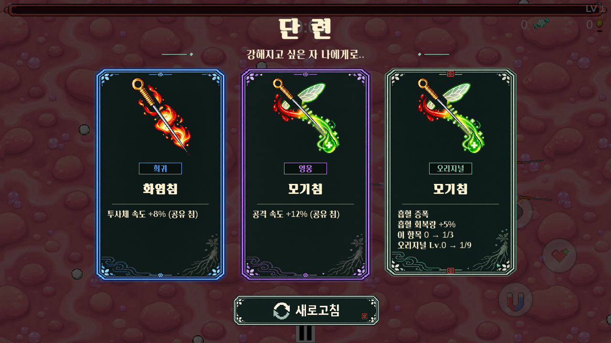

# 단 련 — 증강 선택 패널 (2026-10-01)

승인된 자개·인삼 카드 PNG를 실제 Level 1 증강 선택창에 적용했다. 제목은 **단 련**, 안내는 **강해지고 싶은 자 나에게로..**다. 실제 아이콘·이름·효과·수치·진행도는 게임 데이터로 표시한다.

## 아트와 표시 규칙

- `Assets/Resources/AugmentPanels`: Common(평범/회색), Rare(희귀/파랑), Epic(영웅/보라), Supreme(지존/주황·노랑), Original(오리지널/옥색·낙관), Reroll(새로고침).
- 2026-10-01 생성한 승인 PNG 원본 6개를 그대로 포함한다. 카드와 버튼의 여백은 `AugmentPanelImporter`가 스프라이트 영역으로 잘라 쓰며 원본 픽셀은 수정하지 않는다.
- 모든 신규 카드 안쪽은 같은 어두운 색 계열이다. 등급별 이미지를 직접 교체하며 카드 전체를 등급색으로 물들이지 않는다. 불투명 받침으로 캐릭터가 카드 안에 비치지 않게 한다.
- 최초 특수증강 획득은 회색 프레임에 `특수` 배지를 표시한다. 수치 강화와 오리지널은 실제 등급 배지를 표시한다. 반복되는 제목 접두사·등급 설명만 화면에서 정리하며 효과 수치와 진행도는 유지한다.
- 전설 수치 강화와 처방전의 전설증강은 기존 금색 프레임을 사용한다. 별도 전설 오버프레임은 아직 제작하지 않았다. 기존 프레임의 투명 여백과 설명 배경을 정리해 긴 설명을 읽을 수 있게 했다.
- 새로고침 이미지에는 글자가 포함돼 있어 기존 TMP 글자는 중복 표시하지 않는다. 사용한 버튼은 회색으로 표시하며 1회 사용 제한을 유지한다.

## 동작과 배치

- 검정 70% 반투명 배경, 카드 3장, 하단 새로고침. 카드 전체를 눌러 선택한다.
- 카드 아이콘·설명은 교체 가능한 실제 UI이며 이미지에 합성해 고정하지 않는다.
- 1280×720 기준 배치를 안전 영역에 맞춰 비율 축소한다. 검정 배경은 안전 영역 밖까지 전체 화면을 덮는다.
- 제목·카드·새로고침은 같은 배율로 조절한다. 등장 애니메이션은 일시정지 중에도 재생된다.
- 기존 보상 추첨, 수치, 처방전 보상 경로, 새로고침 규칙을 유지한다. 닫힌 카드의 중복 선택은 무시한다.

## 검증

- Unity 2022.3.62f3 EditMode 기존 테스트 68/68 통과.
- 실제 Level 1의 `AugmentPanelPlaySmoke`: 최종 269개 검사 통과, Error/Exception/Assert 없음.
- 21종 특수증강 최초 획득 설명, 63개 오리지널 설명, 12종 전설 설명의 글자 영역 검사.
- 5개 프레임, 실제 아이콘, 3장 선택, 첫 선택의 실제 보상 적용, 새로고침 1회 제한 및 재개방 초기화, 전설 보상 선택 검증.
- 1280×720, 1024×768, 1560×720에서 카드 간격·화면 경계·포인터/터치 레이캐스트·새로고침 위치 검사.
- Windows x64 Development 빌드 성공, 오류 0. 결과: `Builds/ApothecaryPlayer/24tu.exe` (빌드 파일은 Git 제외).
- 위 캡처는 실제 추첨 풀에서 얻은 희귀·영웅·오리지널 보상으로 촬영했다. 무작위 추첨 때문에 실제 플레이에서 같은 조합이 보장되지는 않는다.
- 자동 UI 검증이며 실제 Android/iPhone 기기 검증이나 장시간 수동 QA를 의미하지 않는다.

실행 명령: Unity `-batchmode -projectPath <repo> -executeMethod Vampire.Tests.Editor.AugmentPanelPlaySmoke.Run -logFile <log>`. 그림 확인이 필요하므로 이 검사에서는 `-nographics`를 사용하지 않는다. 테스트는 장면에 임시 상태를 만들며 저장하지 않는다.

검증 로그: `augment-panel-editmode.xml`, `augment-panel-play-complete.log`, `augment-panel-windows-build.log` (Codex 작업 폴더). 기존 MapPanelRoot/MapViewport의 누락 스크립트 경고는 이번 UI 작업 범위 밖이다.
