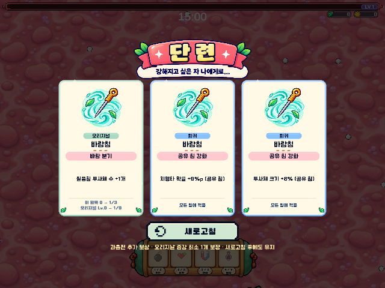
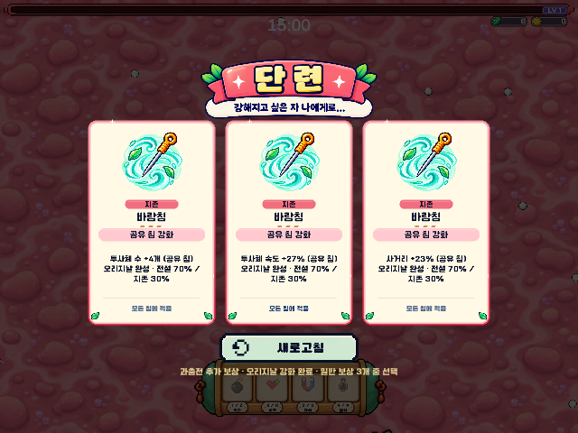

# 2026-10-09 승인 밸런스 패치 · Junhan2 PC 개발판

공유 링크·모바일/웹 빌드·이미지 자산과 압축 설정은 변경하지 않는다. 기존 침 종류와 발사 방향, 캐릭터 액티브/패시브 지속시간을 유지한다.

## 활성 풀과 완성 보상

- 목침·꿀침은 리메이크 준비로 해금/장착/활성화/신규 획득/수치 및 오리지날 후보에서 제외한다. 정의 21종과 저장 ID·기존 해금 이력은 보존하며 활성 부모는 **19종, 오리지날 57항목**이다.
- 예전 시작 무기가 목침·꿀침이면 캐릭터 기본 무기로 복귀한다. 아시 바람침, 혁이 빙결침, 신이 화염침, 아리 침술진.
- 부모별 3항목 × 3회 = 9회 완성 시 그 부모의 이후 수치 강화는 **전설 70% / 지존 30%**. 다른 부모의 진행에는 영향이 없다. 이미 획득한 수치는 재추첨하지 않는다.
- 일반 등급 확률은 평범 34.37% / 희귀 27.49% / 영웅 17.18% / 오리지날 14% / 전설 5.16% / 지존 1.80% 그대로다. 유효 오리지날이 없을 때는 기존처럼 나머지 등급 가중치를 재정규화한다.
- 과충전 미니스테이지 추가 레벨업 상자는 3개 중 **오리지날 최소 1개 보장**. 나머지 2개는 기존 풀·확률이므로 오리지날이 더 나올 수 있다. 새로고침에도 유지하며 같은 부모/옵션은 한 화면에 중복하지 않는다.
- 가능한 오리지날이 0개면 일반 3개와 ‘오리지날 강화 완료’ 안내를 표시한다. 미보유 무기를 보장 목적으로 새로 지급하지 않는다. 기존 새로고침 1회 규칙과 하나만 선택하는 방식 유지.
- 보장은 상자 인스턴스에 저장하고 풀 재사용 시 초기화한다. 동시에 연 상자는 순서대로 지급하며 보상창을 닫으면 문맥을 초기화한다.

## 등급별 수치 · 이전 → 현재

수치 카드는 한 항목만 올린다. 치확은 %p, 발사 수는 개수다.

| 항목 | 평범 | 희귀 | 영웅 | 전설 | 지존 |
|---|---:|---:|---:|---:|---:|
| 피해 | 8→8% | 12→11% | 16→15% | 24→23% | 36→34% |
| 치명타 확률 | 5→5%p | 10→9%p | 15→14%p | 20→19%p | 25→23%p |
| 치명타 피해 | 10→10% | 18→17% | 25→23% | 40→38% | 60→57% |
| 공격 속도 | 5→5% | 8→7.5% | 12→11% | 18→17% | 27→25% |
| 투사체 속도·크기 | 5% | 8% | 12% | 18% | 27% |
| 넉백 | 6% | 10% | 15% | 23% | 35% |
| 사거리 | 4% | 7% | 10% | 15% | 23% |
| 투사체 수 | 1 | 1 | 2 | 3 | 4 |

## 오리지날 변경

| 부모·항목 | 이전 | 현재 (1/2/3회 총효과) |
|---|---|---|
| 관통·관통 가속 | 최초 탄속의 10/15/20%, 대상 5회 고정 | 10/15/20%, 서로 다른 대상 3/4/5회, 총 +30/60/100% |
| 관통·관통 강타 | 이전 관통 대상당 +6/12/18%, 누적 상한 없음 | 대상당 증가량 유지, 최대 5중첩, 총 +30/60/90% |
| 압력·압력 잔향 → 압력 예열 | 최대 거리 피해 도달 시 넉백 +15/30/45% | 발사 시 거리 피해 보너스 상한의 10/20/30% 미리 획득. 거리 증가분과 합산하며 기존 상한 유지 |
| 표식·표식 유지 | 지속시간 +12/24/36% | +20/40/60% |
| 장내균·균총 잔류 → 균총 한계 | 지속시간 +12/24/36% | 최대 중첩 5→6/7/8, 기본 6초 유지 |
| 장내균·균총 증식 | 추가 1중첩 확률 13/26/39% | 유지, 최대 중첩 준수 |
| 장내균·균총 수확 | 조건 충족 처치 시 추가 구슬 확률 10/20/30% | 사망 시 3중첩 초과분당 10/15/20%p, 확률 최대 100%. 기본 1개+추가 최대 1개, 한 처치에 한 번 |
| 화염·화상 축적 | 최대 4/5/무제한 | 최대 4/5/6. 기본 3, 상한 도달 시 가장 오래된 중첩 갱신 |
| 부식·부식 축적 | 기본 3, 최대 4/5/6 | 유지 |
| 공복·공복 한계 | 기본 8, 최대 9/10/11 | 유지 |

그 외 오리지날은 유지한다. 바람침 공속 +8/16/24%, 피해 +10/20/30%, 투사체 +1/2/3; 모기침 회복 +5/10/15%; 유도 선회 +6/12/18%; 빙결 4타 조건 유지. 과잉 회복 보호막은 추가하지 않는다. 카드의 변화량과 TAB 현재 효과 설명도 갱신한다.

## 오류 수정과 복원

- 기본 자동 발사에도 SyringeDartAbility의 유효 쿨타임을 적용한다. 이전에는 상위 ProjectileAbility의 시계가 바람/공복 계수를 생략했다. 다른 투사체 능력의 계산은 유지한다.
- 아시 패시브 배율은 캐릭터 공격 속도에 이미 반영되므로 중복 적용하지 않는다. 침별 순차 발사 지연(실제 프리팹 0.05초)은 유지한다.
- 장내균 추가 경험치 확률은 사망 시 남은 중첩으로 계산한다. 만료된 중첩의 오래된 확률을 재사용하지 않으며 중복 사망 알림으로 보상이 늘지 않는다.
- 예전 목침/꿀침 오리지날 기록은 능력을 활성화하지 않는다. 그 부모로 받은 공유 수치 강화는 저장된 양 그대로 복원하여 다른 강화 기록과 런 능력치를 유지한다.
- 후보 표시/새로고침/동일 저장 재복원으로 증강이 중복 적용되지 않는다.

## 검증

Unity 2022.3.62f3, 실제 Level 1 아시 캐릭터를 사용하는 자동 PlayMode 검사. 수동 조작 완주나 모든 조합의 최종 난도 확정을 뜻하지 않는다.

- `ApprovedBalanceTests.Run`: **14개 검사 통과**. 기본·에셋 45개 수치 일치, 10,000 구간 등급 분포, 부모별 완성 70/30 경계, 중첩 상한, 압력 예열, 해금 차단, 기존 입력/저장/설명 회귀 검사.
- `AshiBalanceSmoke.Run`: **3,637개 조건 검사 통과** (분포/보장 반복 표본 포함). 400회 보장 보상 생성에서 오리지날 보장·동일 옵션 중복 제외·미선택 상태 불변 확인. 실제 보상창 새로고침, 중복 선택, 상자 동시 개봉/풀 초기화, 후보 소진 후 3개 유지 확인.
- 완성 부모 3,000개 수치 카드: 전설 **2,109**, 지존 **891**. 정확한 70/30 경계는 별도 전수 구간 검사로 확인한다.
- 실제 18초 발사 간격: 바람 기본 **0.736232초**, 바람 공속 3회 **0.622024초**, 추가 공복 8중첩 **0.495714초**. 유효 쿨타임+2발×0.05초와 프레임 오차 안에서 일치.
- 정지한 HP2500 미니보스를 실제 아시 투사체로 8초 타격: **151.2007 피해**. 단일 조건 동작 확인이며 전체 런 DPS 예측치가 아니다.
- 화상 40회 적용 시 각 단계 3/4/5/6 유지. 장내균 8중첩·수확 3회에서 구슬 2개, 만료 후 3중첩이면 1개, 중복 지급 없음.
- 실제 과충전 혈전 입장/보상 상자/퇴장, 스테이지 2 입장 후 증강 기록과 수치 일치. 과거 목침/꿀침 기록을 섞은 복원도 활성 19종을 보존하고 저장 수치를 재추첨하지 않음.
- `AshiBalanceSmoke.RunUI`: 보장/새로고침/소진 안내의 실제 UI 캡처 확인. 게임용 이미지 제작·원본 압축 변경 없음. 640×480 실제 렌더 캡처에서도 안내 문구와 카드가 겹치지 않음.

재현 명령: Unity 에디터 `-batchmode -projectPath <repo> -executeMethod Vampire.Tests.Editor.ApprovedBalanceTests.Run`; PlayMode는 `Vampire.Editor.AshiBalanceSmoke.Run`, UI 캡처는 `Vampire.Editor.AshiBalanceSmoke.RunUI` (UI 검사는 `-nographics` 제외). 자체 종료하므로 `-quit`를 붙이지 않는다. 로그·캡처·설정 백업은 Library/AshiBalanceSmoke 및 지정 logFile에 저장한다.

