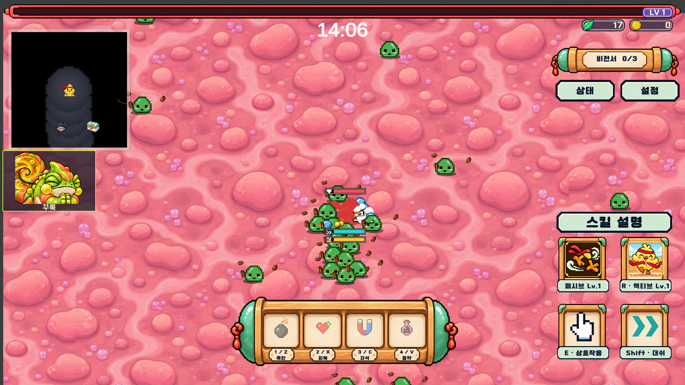
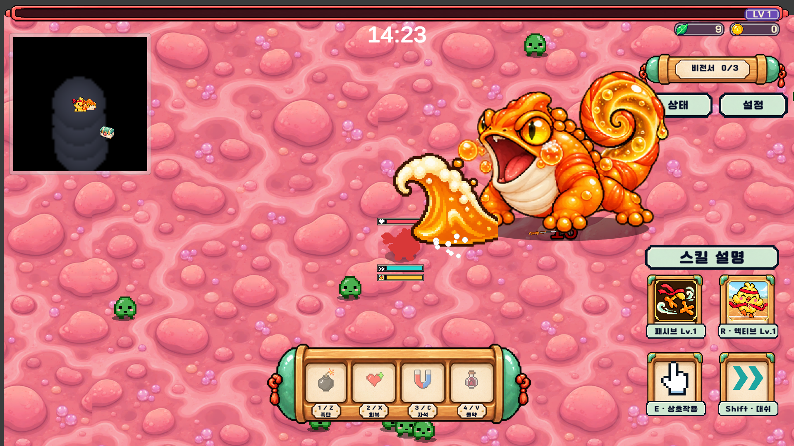
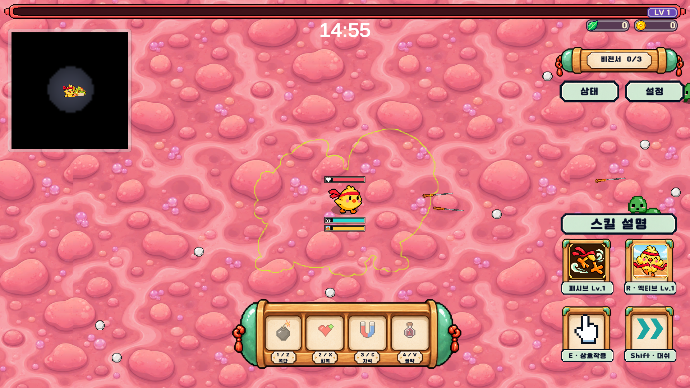
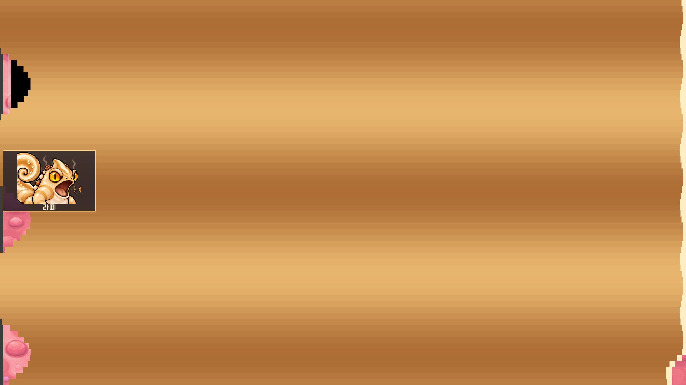

# 카멜레온 미니보스 · Junhan2 개발판

2026-10-08. 공유 웹 PC/모바일 빌드는 갱신하지 않는다. 이번 원본 PNG는 리사이즈·압축하지 않았고 Unity도 Uncompressed/Point/No mipmaps로 임포트한다.

## 네 종류와 공통 전투

| 이름 | 담당 이벤트 | 고유 스킬 |
| --- | --- | --- |
| 꾸룩 · 위산연동 카멜레온 | 위산연동파 | 왼발·오른발 쿵쿵 → 박수 → 좌우 연동파 정확히 2회 |
| 보글 · 제산거품 카멜레온 | 제산 거품 폭주 | 앞발을 모아 힘주기 → 거품 방출 → 기존 안전 거품 장판 3개 |
| 톡톡 · 환타 카멜레온 | 환타 파도 | 볼 팽창·경로 경고 → 단일 환타 파도 1개. 기존 두꺼비를 교체 |
| 라떼 · 커피수혈 카멜레온 | 커피수혈 | 입에서 위로 커피 분수 → 낙하한 뒤 주변 다른 몬스터에 커피 버프 |

기본 HP **2500**, 접촉 공격 16, 접근 속도 **0.8**, 패턴 뒤 대기 2.1초. **기본 공격 → 순간이동 → 기본 공격 → 고유 스킬** 순환. 2026-10-08 후속 조정에서 체력 1200→2500, 이동 0.75→0.8로 변경하고 고유 스킬 전에도 기본 탄막을 추가했다. 기본 공격은 준비 0.6초 뒤 -14/0/+14도 탄막 3발, 피해 8, 속도 3.2. 각 속성별 신규 탄환 이미지를 사용한다. 보상은 기존 미니보스 체계를 유지한다.

별도 평타 타이머를 중첩하지 않고 기존 예고/회복 시간을 유지한다. 중단·일시정지가 없을 때 기본 공격 시작 간격은 순간이동을 사이에 두면 약 10.9초, 고유 스킬을 사이에 두면 꾸룩12.55초·보글7.95초·톡톡8초·라떼9.1초다. 이동은 실제 Blueprint의 movespeed를 읽어 설정과 동작을 일치시킨다.

순간이동은 0.35초 동안 투명해진 뒤 **완전 은신 3초**, 플레이어 위치를 한 번 고정하여 **몸 실루엣 외곽선만 1초** 예고한다. 본체가 돌아오는 순간 플레이어 중심이 실제 이미지의 불투명 영역에 있으면 피해 16. 경고 중 플레이어를 추적하지 않으며 은신 중 피격·접촉 충돌·그림자를 해제한다. 중단·혈전 이동·사망·풀 복귀 시 상태를 정리한다.

### 고유 스킬 초기 수치

- 꾸룩: 준비 발 구르기 각 0.45초, 박수 준비 0.5초, 좌/우 각 2.2초. 플레이어 힘 7, 몬스터 힘 5, 해당 방향 속도 상한 4.
- 보글: 약 1.2초 준비 뒤 플레이어 주변 반경 2.2에 안전 거품 3개, 각 반경 설정 1.8·지속 6초. 1초 적응 시간 뒤 모든 거품 밖에 있으면 0.5초마다 피해 3. 보스가 움직여도 장판 위치는 고정. 필드 이벤트의 보상 상자를 중복 지급하지 않는다.
- 톡톡: 1.15초 경로 예고, 이동 거리 11·이동 시간 2.1초·높이 1.5인 하나의 파도, 피해 8·재피격 간격 0.6초. 기존 조각/연속 분사를 실행하지 않는다.
- 라떼: 약 0.95초 준비, 1.6초 동안 분출·낙하한 다음 다른 살아 있는 필드 몬스터에 8초 커피 버프. 기존 추가 이동 힘 2.5·방향 속도 상한 2 및 원두 공전 표시를 재사용한다.

스폰된 미니보스의 스킬에서는 옆 화면 초상화/커피 전체 덮기를 만들지 않는다. 원래 필드 장판·이벤트 피해 설정은 유지하며 위 초기값은 새 미니보스 스킬에만 적용한다.

## 필드 이벤트 연출

- `ScreenSpaceOverlay` 안전 영역에 고정된 좌/우 패널. 카메라 이동·기울기·흔들림과 무관하게 화면에 고정된다. 클릭을 가로채지 않는다.
- 꾸룩/보글/라떼는 연출마다 좌우 무작위. 톡톡은 기존 좌우 교대 방향을 유지한다.
- 위산연동파: 상반신 박수 후 시작, 기존 방향 전환 직전에 다시 박수. 준비 0.8초 동안 실제 기류가 먼저 발동하지 않는다.
- 제산 거품: 월드 특수 동작 8~12번을 상반신으로 잘라서 시작 경고 중 한 번 재생한다.
- 커피수혈: 기존 위에서 쏟는 연출은 호출하지 않는다. 옆 패널에서 커피를 뿜고 옆으로 퍼진 커피가 화면 전체를 덮었다 걷힌 뒤 버프 적용. 0.45초 준비 + 2.4초 화면 흐름 뒤 기존 이벤트 지속시간을 계산한다.
- 환타: 고정 얼굴 패널의 볼 팽창·경로 예고, 단일 파도 이동·회복. 발사체는 월드 오브젝트이며 얼굴 패널은 UI다.
- 일시정지·혈전 입장 중 연출 시간도 멈추며 패널은 숨긴다.

## 등장 확률

기존 경과 **7:00~7:30** 중 무작위 시각에 네 종류 중 하나를 1회 선택한다. 시작은 각각 25%. 선택 전 담당 필드 이벤트가 시작할 때 해당 종류에 **20%p**를 더하고, 아직 한 번도 발생하지 않은 다른 이벤트 종류의 확률에서 균등하게 가져온다. 바닥은 0%, 합계는 100%. 남은 제공 확률이 20%p 미만이면 남은 만큼만 이동하며 제공자가 없으면 변경하지 않는다. 이미 발생한 다른 이벤트 종류에서는 빼지 않는다.

예: 꾸룩 이벤트 1회 → 꾸룩 45%, 나머지 약 18.333%씩. 다음에 보글 이벤트 → 꾸룩 45%, 보글 약 38.333%, 나머지 약 8.333%씩. 스폰 시각의 선택을 고정하고 이후 이벤트로 재추첨하지 않는다. 다음 스테이지 시작 때 확률/일정 초기화.

## 자산·크기·연결

`Assets/Resources/Chameleons/`의 Drift/Foam/Fanta/Latte PNG 각각 16포즈, Projectiles PNG 5개. 승인 원형과 음식/음료 색을 기준으로 제작했다. PNG 파일 자체는 수정하지 않고 Unity Sprite 영역으로 분리한다. Foam/Latte 원본 행 배치는 4/4/5/3이므로 동일한 4×4 격자로 자르면 안 된다.

0~1 대기/눈깜박임, 2~5 걷기, 6~7 기본 공격, 8~12 고유 스킬·회복, 13 피격, 14~15 사망. 투명화는 대기 프레임의 알파 연출. 모든 런타임 몸 프레임 너비 2.8, 루트 배율 1.2로 최종 3.36. 프레임마다 루트 스케일을 바꾸지 않으며 발 피벗을 통일한다. 자세 변화에 따른 높이·실루엣은 유지한다. 그림자도 기존 지면 기준 시스템을 사용한다.

지도·화면 밖 방향 안내·설명집 시연을 해당 종류 이미지에 연결했다. 환타 안내 ID `monster/acid-toad`와 이벤트 ID는 기존 확인 기록 호환을 위해 유지한다. 추가 3종을 포함한 설명집은 46항목이다. 저장된 씬/풀 호환을 위해 `AcidToadMonster` 컴포넌트 GUID와 기존 Fanta 블루프린트 파일은 유지한다.

## 검증

2026-10-08 체력/이동/평타 후속 조정: 실제 Level 1 검사 **132개 통과** (`D:/Project_GC/work/MinibossTravel-20261008/chameleon-r3.log`, `CHAMELEON_FINISHED failed=False`). 네 종류의 실제 스폰 HP2500·접근 속도0.8과 자동 패턴의 기본→순간이동→기본→고유→기본 반복을 확인했다. 기존 공격·필드 연출·확률·중단 정리도 함께 재검사했다. 별도 혈전 왕복/무적 검사는82개 통과. 공유 링크·웹/모바일 빌드·이미지 압축은 수행하지 않았다.

Unity 실제 Level 1 플레이 검사 `Vampire.Editor.ChameleonSmoke.Run`. 아트/크기/미압축, 확률 보존, 4종 전투와 순간이동·중단·죽음, 화면 고정, 단일 파도, 월드/필드 스킬 분리, 커피 버프 시점, 이벤트별 확률 연결을 확인한다. QA 캡처는 강제 소환·테스트 체력으로 촬영한 것이며 자연 플레이 녹화가 아니다. 자연 15분 완주 밸런스와 모바일 실기기 QA는 이번 범위에 포함하지 않는다.

최종 카멜레온 검사 108개 통과. 기존 스테이지 2 전환 검사 97개, 읽기 전용 도움말 30개, 미니스테이지 QA 23개도 재검사 통과했다. 이 중 확률 검사는 2,500번의 이벤트 갱신에서 0% 이상·합계 100% 보존을 확인한다. `Artwork.json`의 SHA-256은 생성 원본과 게임 PNG의 바이트 일치를 확인한 값이다. 인접 포즈의 떨어진 조각은 텍스처 편집 대신 런타임 스프라이트 메시로 제외하며 첫 플레이어 업데이트에서 적용한다.

