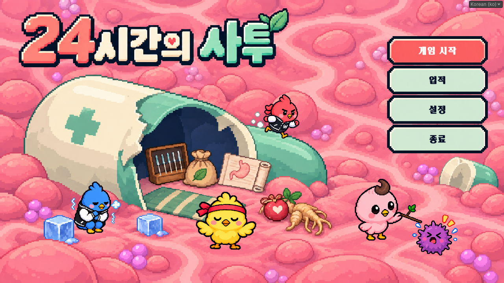
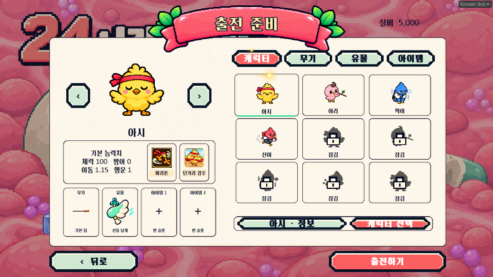
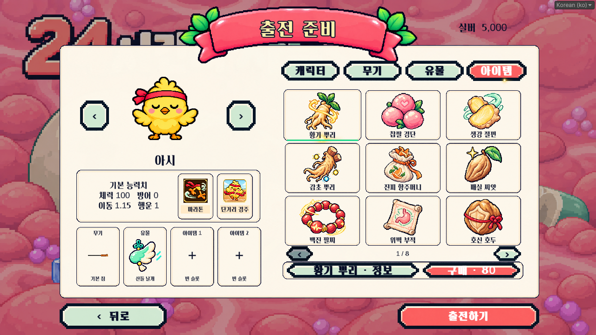
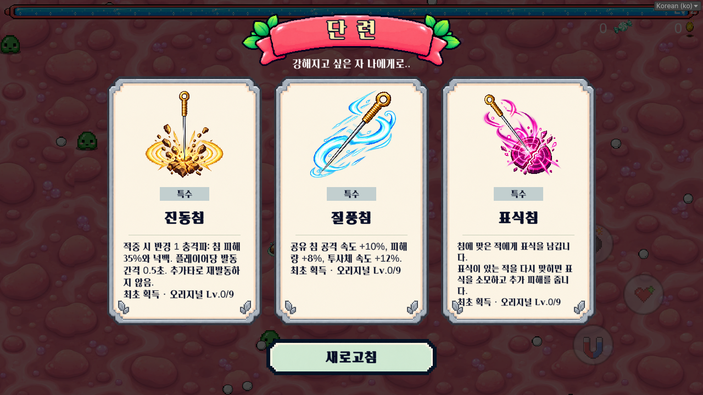
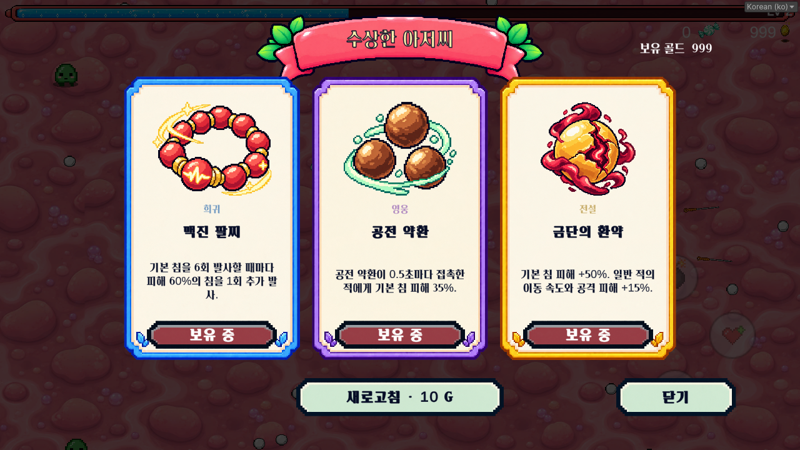
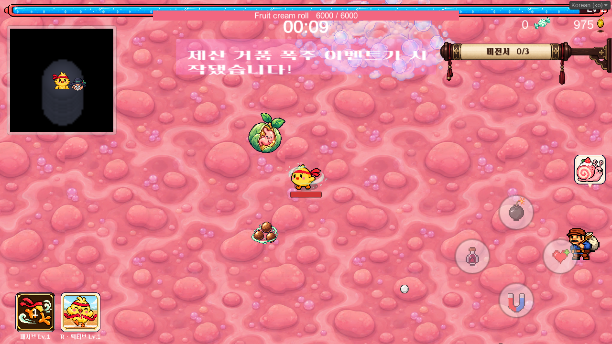

# 2026-10-01 UI 및 콘텐츠 통합

기준: Junhan2 f3ad10e. 사용자가 제공한 6종 UI 시안, PDF 유물 디자인, Excel 아이템 66종, Word 방 배경 및 낙하 음식.

## 적용 내용
- 캡슐 시작화면에 네 캐릭터와 세균을 별도 배치. 혁이 떨기·신이 달리기·아시 중재·기본 아리 찌르기를 이미지 이동/회전으로 표현. 게임 시작·업적·설정·종료 4버튼.
- 출전 준비 왼쪽 캐릭터/능력치/스킬/장비 고정, 오른쪽 캐릭터·무기·유물·아이템 4탭. 캐릭터 변경 시 장비 유지, 원본 실루엣+자물쇠와 현장 해금. 미래 캐릭터 5칸은 임시 실루엣이며 선택 불가.
- 공통 민트 기본/산호색 활성 버튼, 누름 축소·호버 확대·테두리 회전 빛. 1280×720 기준 전체 화면 비례 확대. 버튼 외곽은 공통 9-slice 자산을 공유.
- 단련·NPC 구매: 동일 크림색 내부와 등급 테두리. 고귀 11종은 유지. TAB 탐험 기록·ESC 설정도 공통 테마 적용.
- 결과는 캐릭터 4종 × 성공/실패 8포즈. 같은 패널 크기·통계 위치·3버튼(메인으로/다시하기/준비화면). 실패 보라/성공 산호색 띠. 실제 정산 실버와 획득 기록을 표시하며 없는 소모품 보상을 만들지 않았다.
- 지도: 보스·플레이어·혈전·상인·엘리트 자판기 마커/범례. 화면 밖 보스의 가장자리 아이콘 추적, 화면 안/가까운 거리/혈전 내부에서는 숨김.
- PC 옛 일시정지·지도 버튼 숨김과 키보드 유지. 기존 필드 소모품 인벤토리·모바일 조작 유지.
- 전체화면에서 창 모드로 전환할 때 엔진이 창 크기를 늦게 적용하는 경우, 최신 요청을 최대 3번 확인·재적용한다. 자동 실행 검사는 배경에서도 진행하도록 설정하며 일반 플레이 설정은 바꾸지 않는다.
- 아이템 66종과 원본 아이콘 적용. 실제 수치/발동 간격/상한/가격은 [아이템 상세](Items.md), 원본 대응은 `ItemCatalogSource.json`에 기록.
- 로비 실버 구매 최대 2개·캐릭터 변경 시 유지·출전 시 한 번 적용 후 슬롯 소모·출전 전 장착 해제 환불. NPC는 런 골드로 거래. 같은 효과 경로와 중복 획득/이중 차감 방지.
- 씬 이동 스냅샷에 아이템 보유·대기 경험치·초과 회복·카운터·저항·재사용 대기/충전 상태를 보존. 새 디스크 런 저장 기능은 아니다.
- 원본 월드 크기의 혈전 배경, 8개 두꺼운 정적 충돌벽과 이동/대시 위치 제한. 벽 안 생성과 저격수 둘레 배치. 음식 6종 가속 낙하·김말이/어묵 방향 보정·노랑→주황→빨강 투명 경고.

## 검증
- EditMode **68/68 통과**.
- 실제 씬: 거래·장비 유지·66개 등록·조건부 저항/초과 회복·혈전 6종 왕복·대각선 대시 24회·벽 안 생성·보스 4방향·결과 8종 검사. 최종 **308개 통과**: [play-validation.txt](play-validation.txt).
- Windows x64 Development 빌드 **성공·오류 0**, 실제 실행 검사 **8개 통과**. 최종 검증일 2026-10-02. [실행 검사 기록](windows-player-validation.txt).
- 캡처 일부는 HP/골드 또는 전체 아이템을 검사 목적으로 지급했다. 자연 플레이 완주·장기 조합 밸런스·Android/iPhone 실기기 성능/터치는 후속 QA다.
- 기존 지도 오브젝트 미연결 스크립트 경고 2건은 이번 기능 검증과 구분한다.

## 범위 결정
- 고귀 증강 11종의 오버프레임 카드는 유지한다. 일반 등급 증강 및 NPC 아이템 구매 프레임을 새 시안으로 교체한다.
- 평범/희귀/영웅/전설/지존 테두리는 회색/파랑/보라/주황금/검붉은색. 오리지널은 민트.
- Excel 두 목록 33종씩 총 66종. 능력 의도를 유지하고 발동 조건·간격·상한·가격을 초기 밸런스로 확정했다. 초과 회복 HP 25%, 연속 처치 피해 30%, 종류별 저항 20%, 감속 70%, 동시 불장판 3개 상한.
- PDF는 기존 유물 3종의 효과를 유지하며 수호 노리개의 체력/이동/치명 아이콘을 대응했다. 몸속 수호부/약옥 노리개는 제외. 나머지 PDF 그림을 새 유물 효과로 임의 추가하지 않았다.
- Word 방 배경은 이름 표기가 없어 위험 색상과 가독성을 기준으로 배정한다. 제외된 미니스테이지는 스폰풀에 다시 추가하지 않는다.
- 기존 체크아웃의 미커밋 이미지 메타데이터는 보존한다.

## 방 배경 대응
낙하 음식 Room1 / 골드 수집 Room2 / 저격수 Room3 / 자폭 돌진 Room4 / 경험치 수집 Room7 / 미스터리 Room8. Room5는 보관한다. 혈전 내에서는 필드 미니맵을 숨긴다. 기존 일반/격화 보상·한 개 상자 선택 규칙은 유지한다.

## 수정 위치·재현
- `Assets/Resources/OctoberContent/`: 원본 대응 JSON, 아이템/음식/방 이미지 및 아이템 66개 데이터. 아이템·음식은 임포트 최대 512, 원본 PNG는 보존.
- `Assets/Resources/OctoberUI/`, `Assets/Resources/AugmentPanels/`: 새 이미지. 제작 프롬프트는 이 문서 폴더의 JSON 2개.
- `OctoberItemBalance.cs`, `OctoberItemRuntime.cs`, `OctoberItemEffects.cs`: 아이템 수치/효과. 샷건·대물침·이기어침 적중 연결. 대물침 미리보기는 공격으로 집계하지 않는다.
- `ApothecaryUI.October.cs`, `.Merchant.cs`, `.BossCompass.cs`, `OctoberArt.cs`: 화면.
- `MiniStageArenaGeometry.cs`, `MiniStageFallingFoodStrike.cs`: 벽과 경고/낙하.
- 설치: `Vampire.EditorTools.OctoberContentInstaller.Install`.
- 실제 씬 검사: `Vampire.Tests.Editor.OctoberIntegrationSmoke.Run`. 설정·지갑·해금 저장 복원.
- 빌드: `Vampire.Tests.Editor.ApothecaryBuildCheck.Run`. 결과 `Builds/ApothecaryPlayer/24tu.exe` (Git 제외).
- 개발 실행 파일의 `-apothecarySmoke`: 창 크기·표시 모드·설정 복귀 검사 후 종료.

## 실제 화면

