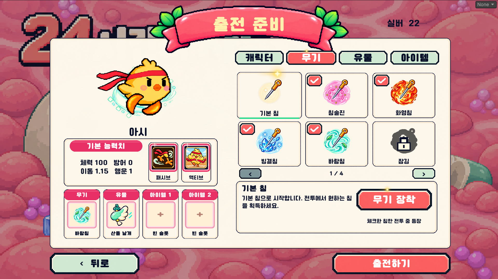
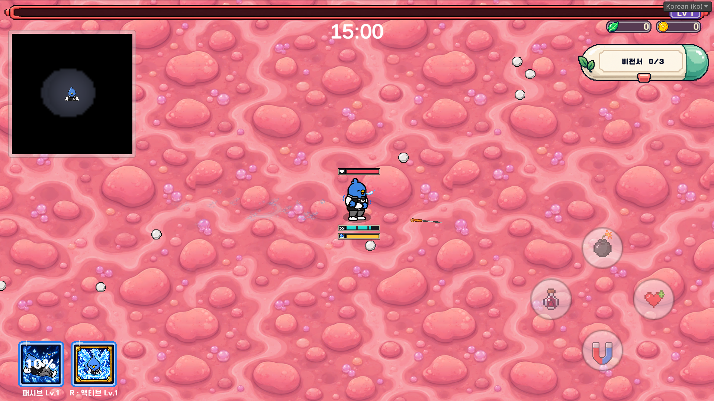
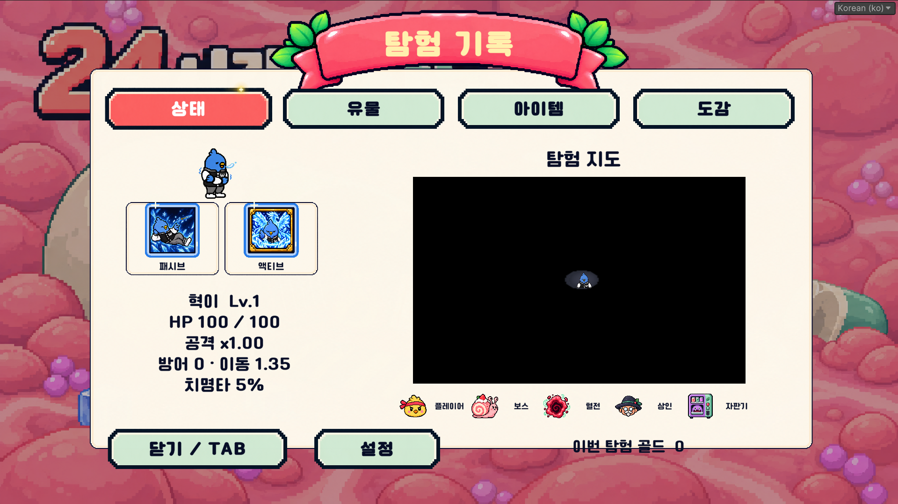
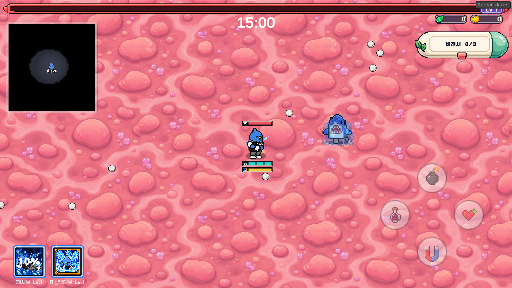
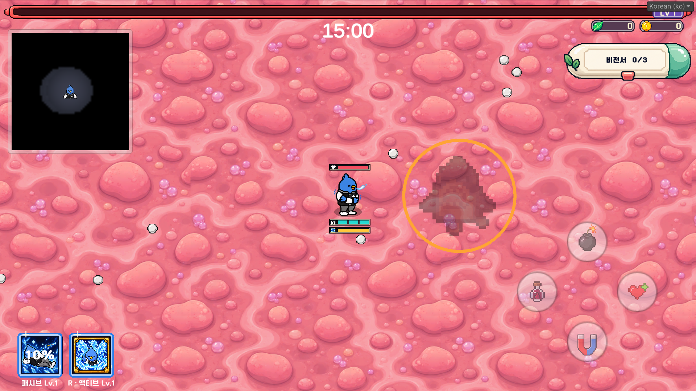

# 24시간의 사투 · 2026-10-04 플레이 QA

기준 브랜치: `Junhan2`. 작업 경로: `D:/Project_GC/Project_GC`.
사용자 플레이 기록을 구현한 패치이며 수치는 초기 테스트값이다. 설치 파일 배포·업로드는 하지 않는다.

## 적용 범위

- 증강 선택 중 Tab 탐험 기록을 열고 닫을 수 있다. 증강 패널은 잠시 숨기며, 돌아오면 기존 선택지와 일시정지를 유지한다.
- 혁이의 덩굴 속박 중 물리 이동·대쉬를 차단한다. 함정에 빙결을 걸어도 함정 컴포넌트를 비활성화하지 않아 포획이 의도치 않게 해제되지 않는다. 정상 방향키 탈출 규칙은 유지한다.
- 빙결 감옥은 몸 크기를 감싸는 균일 배율로 표시한다. 부모 오브젝트가 가로·세로로 달라도 원본 얼음 비율을 유지한다.
- 죠스바 그림자를 최신 걷기 이미지의 발 기준점과 본체 폭에 맞춘다.
- 혈전 과충전을 시작한 뒤에는 미션 완료 전 입장 불가. 범위 밖에서는 진행 정지·누적 보존, 완료 후 격화 입장. 과충전 시작 전 일반 입장은 유지한다.
- 저격수는 필드/미니스테이지 각 활성 전투 공간에서 최대 5마리. 방 밖에서 중지된 필드 저격수는 방 안 개체 제한과 분리한다.
- 비전서는 클릭 한 번으로 펼치고 4초 뒤 자동으로 올라가며 닫힌다. 다시 클릭해 바로 닫는 동작도 유지한다.
- 출전 준비 > 무기 항목 왼쪽 위 체크박스로 해금 무기를 활성화/비활성화한다. 선택은 로컬 저장된다. 비활성 무기의 신규 획득·수치 강화·오리지널 강화 후보를 제외한다. 잠긴 무기는 제외 상태 유지, 고귀 풀은 별도 유지한다.
- 후보가 완전히 사라지는 상황을 막기 위해 해금 무기 최소 1종을 활성화한다. 장착했던 무기를 비활성화하면 시작 특수침 지급에서 제외되며 기본 침으로 출전한다.
- 스테이지 타이머는 15:00에서 00:00으로 감소한다. 표시와 보스 시간표가 같은 런 시간을 사용한다. 미니스테이지·일시정지 중 런 시간 정지 규칙 및 수동 조기 소환은 유지한다.

## 캐릭터 주변 게이지

- 머리 위: 산호색 체력 + 하트.
- 발 아래: 민트색 대쉬, 그 아래 금색 액티브. 두 줄은 중앙 정렬이며 몸과 작은 간격을 둔다.
- 세 종류 모두 동일한 어두운 외곽·밝은 안쪽 테두리·막대 형태. 1280×720 기준 76×12, 줄 간격 3.
- 액티브는 기존 캐릭터별 아이콘을 공유한다. 대쉬는 참조 시안의 겹화살표 기호, 체력은 같은 픽셀 스타일의 하트다. 기존 입력 HUD/터치 버튼은 유지한다.
- 대쉬 최대 횟수만큼 분할하며 기본 분할 간격 3. 충전 완료 칸/충전 중 칸/빈 칸을 구별한다. 실제 순차 충전 진행도를 연결한다.
- 액티브는 실제 남은 쿨타임을 역산해 채운다. 캐릭터별 쿨타임 단축을 반영한다.
- 애니메이션 프레임 크기 변화에 흔들리지 않도록 기본 대기 이미지의 머리·발 기준점을 사용한다. 사망·전체 메뉴·일시정지 중 표시하지 않는다.

## 초기 밸런스

| 항목 | 이전 | 적용값 |
|---|---|---|
| 화염침 스택당 틱 | 최대 HP 0.5%/초 | 최대 HP 0.8%/초 |
| 신이 불기둥 | 침 피해·화상 중첩·남은 틱 정산 | 독립 기본 35 × 일반 피해 배율 × 액티브 강화, 화상 미소모 |
| 영웅 저격방 순간이동 | 발사 후 0.2초, 쿨타임 없음 | 재배치 후 6초 대기, 그 후 발사 시 0.2초 예고; 입장 직후도 6초 확보 |
| 낙하 웨이브 간격 | 0.65~1.15초 | 0.45~0.8초 |
| 낙하 사전 경고 | 0.85~1.25초 | 0.65~0.9초 |
| 음식 실제 낙하 | 0.45초 | 0.28초 |
| 위산분비 장판 틱 피해 | 3 | 4.5 |
| 제산 안전지대 밖 틱 피해 | 2 | 3 |

화염침의 부여 확률·기본 지속 3초·기본 3중첩 및 보스 틱 상한은 유지한다. 신이 불기둥은 비치명타이며 기존 보스 피해 보정·부식 받는 피해 배율은 유지한다. 낙하 방 제한시간은 바꾸지 않는다.

낙하 위험 표시는 경고등 대신 해당 음식의 어두운 실루엣과 실제 피격 반경의 원형 테두리다. 테두리는 주황→빨강으로 변하며 마지막 구간에 두께가 맥동한다. 별도의 영웅 추가 폭발 예고는 유지한다.

## 검증

- Unity EditMode: **72/72 통과**, 실패·건너뜀 0.
- 실제 Level 1 자동 검사: **111개 통과**, 런타임 오류 0. 실제 게이지·쿨타임 연결, 증강↔Tab 일시정지 복귀, 4초 자동 접힘, 혁이 포획+함정 빙결+대쉬 차단, 필드/영웅 저격방 5마리 제한과 순간이동 재사용, 비활성 부모의 반복 증강 추첨 제외 등을 확인했다.
- Windows x64 Development 빌드: 성공, 오류 0. Windows 신이 실행 회귀 통과(`FINISHED passed=True`): 독립 불기둥 피해·화상 미소모·무중첩 동일 피해·0.8% 틱·대쉬/액티브·사망 정리·혁이 구 수면 시스템 비활성 상태 확인.
- 추가 발견/수정: 시작 무기 획득 뒤 전투 상태 캐시가 첫 증강 메뉴까지 갱신되지 않던 초기화 문제. 획득 즉시 갱신하도록 변경하고 Windows 실행에서 시작 화염침 효과를 확인했다. 자동 검사는 기존 무기 선택/사용 설정을 보존·복원한다.
- 일부 조건은 자동 검사에서 직접 설정했다. 자연 플레이 완주 및 Android/iPhone 실기기 검증을 대신하지 않는다.
- 기존 지도 오브젝트 미연결 스크립트 경고는 이번 범위에서 수정하지 않았다.

### 실제 적용 화면

낙하 경고 검증 화면은 임의 스프라이트로 그리기 경로를 검사한 예시다. 실제 낙하 방에서는 기존 음식 6종 중 선택된 음식 그림이 들어간다. 타이머·체력 등은 검사 편의를 위해 고정한 값이다.

## 후속 플레이 확인

- 세 게이지의 실제 전투 가독성, 색각 구분, 다수 투사체와의 겹침.
- 정상 방향키 탈출, 속박 중 피격·빙결·사망·장면 이동.
- 해금 무기 1종만 켰을 때 성장 후보와 비활성 시작 무기 안내.
- 강화된 화염침·독립 불기둥·장판 피해로 15분 완주 난이도 재평가.
- 15분 평균 레벨 약 45는 사용자 관찰값으로 보관. 이번 패치에서 경험치 수치는 변경하지 않았다.
- 액티브/패시브 풀 재편, 제산 배경색, 상점 강화 아이디어는 이번 구현 범위에 포함하지 않았다.
