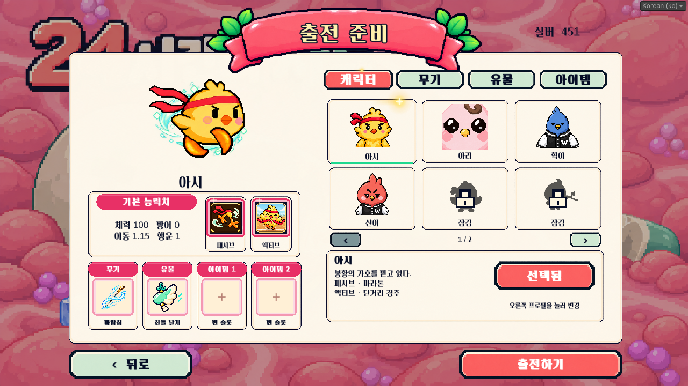
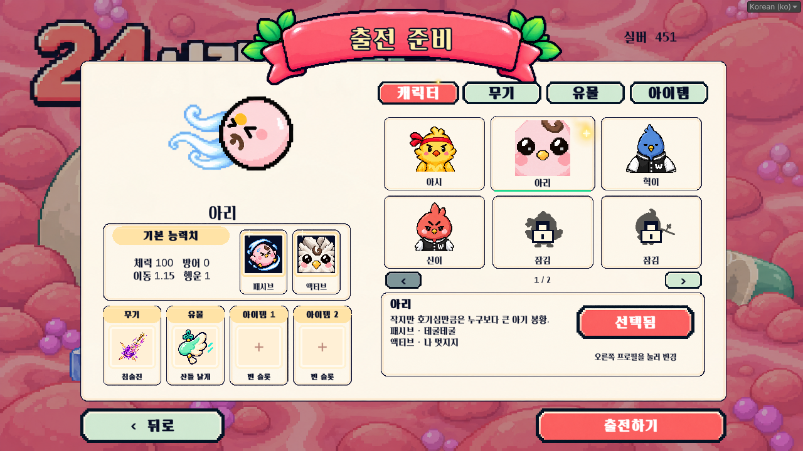
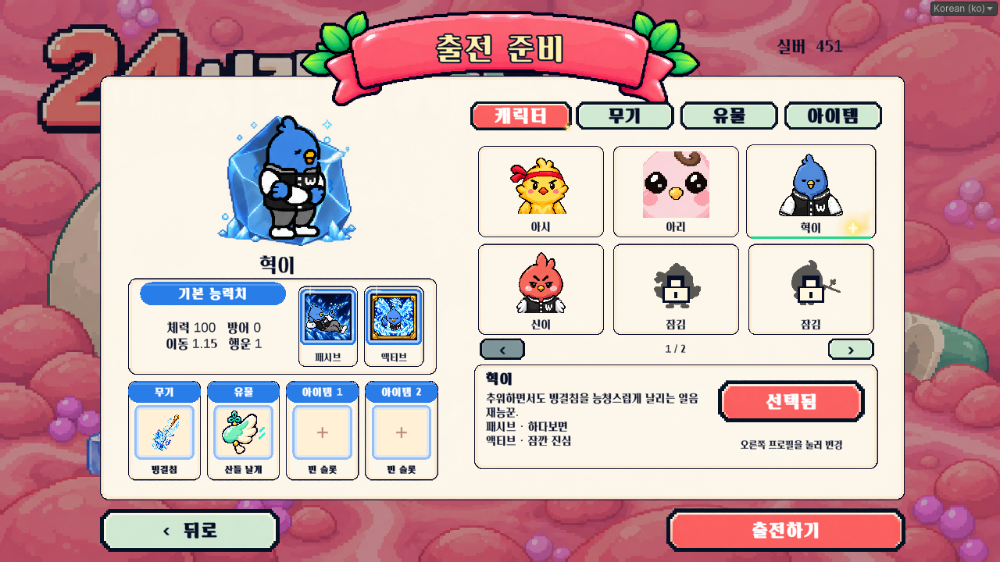
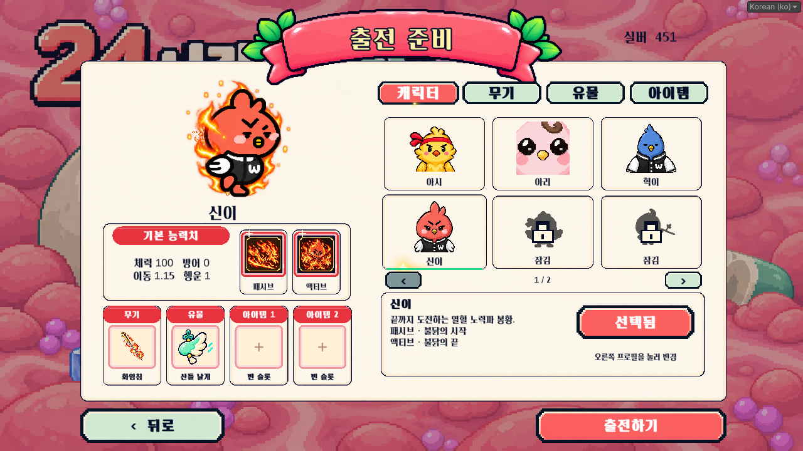
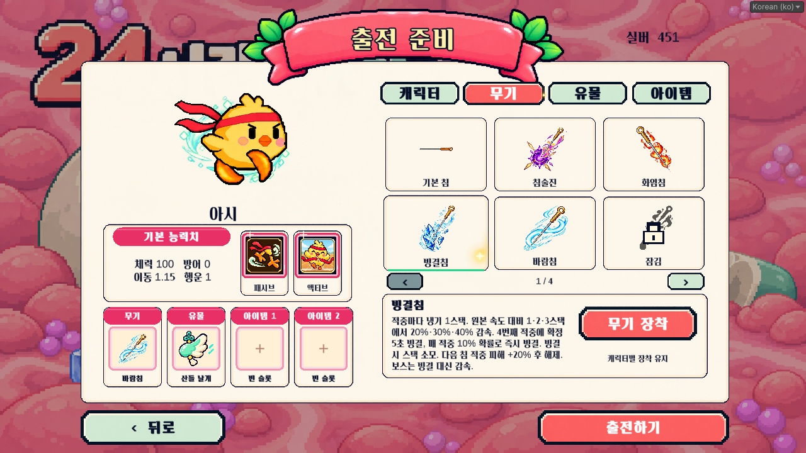
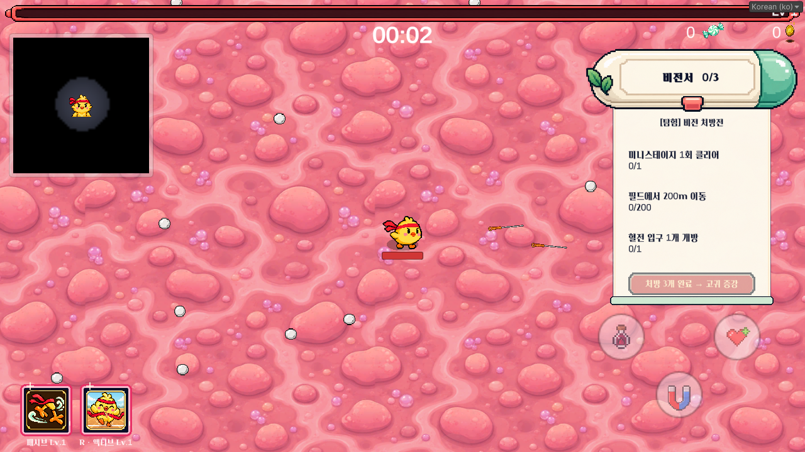
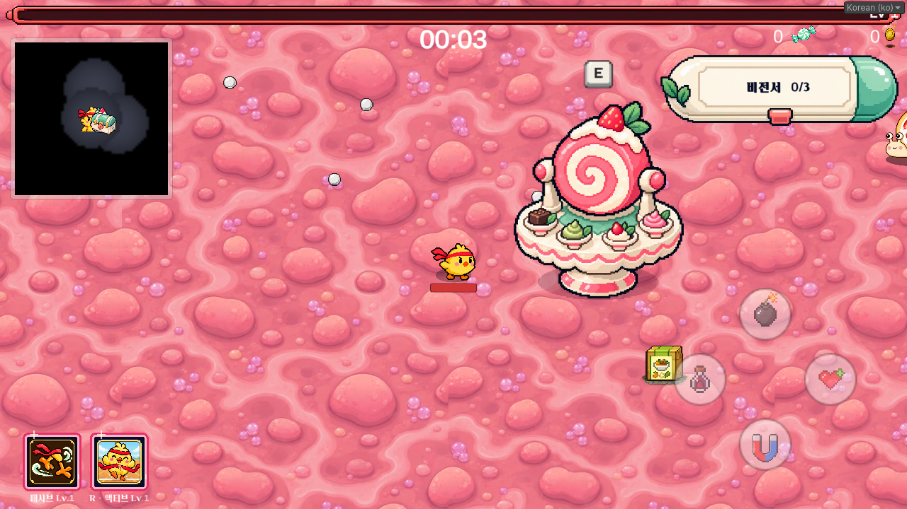
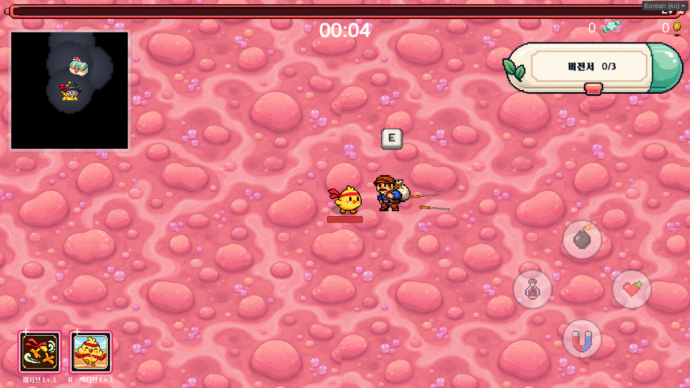
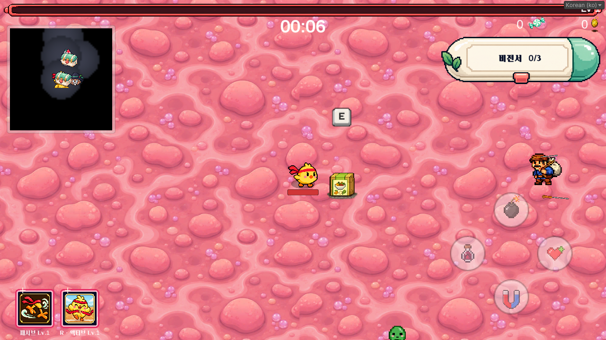

# 출전 준비·상호작용 개편 — 2026-10-02

## 출전 준비

- 오른쪽 캐릭터 타일은 기존 상반신 프로필을 사용한다. 아리는 기존 얼굴 확대 프로필을 유지한다.
- 왼쪽 캐릭터 변경 화살표를 제거했다. 오른쪽 프로필을 누르면 즉시 캐릭터와 능력치·스킬·기본 무기가 바뀐다. 유물과 소지 아이템은 유지한다.
- 큰 캐릭터 영역은 실제 게임 애니메이션을 사용한다. 아시의 질주와 바람, 아리의 구르기, 혁이의 얼음, 신이의 화염을 반복 시연한다. 모션 줄이기 설정에서는 정지한다.
- 기본 능력치·무기·유물·아이템 1·아이템 2에 둥근 색상 띠를 복원했다. 아시는 짙은 분홍색, 아리는 요구르트색, 혁이는 파란색, 신이는 붉은색을 쓴다.
- 패시브·액티브 아이콘을 동일한 정사각 액자로 감싼다. 캐릭터 색 테두리와 작은 반짝임을 출전 준비와 Level1 HUD에서 공유한다.
- 작은 버튼의 모서리 크기도 버튼 높이에 비례해 줄인다. 클릭 눌림과 테두리 빛 효과는 유지한다.
- 선택 목록을 한 페이지 6칸으로 배치하고 아래 설명 영역을 늘렸다. 정보 버튼을 누르지 않아도 설명이 보이며 선택·구매 버튼을 오른쪽에 배치한다.

| 캐릭터 | 기본 무기 |
| --- | --- |
| 아시 | 바람침 |
| 혁이 | 빙결침 |
| 아리 | 침술진 |
| 신이 | 화염침 |

4종의 기본 무기는 해당 캐릭터 해금과 연결한다. 현재 4명 모두 기본 해금 상태이므로 서로의 시작 무기도 선택할 수 있다. 장착 선택은 캐릭터별로 저장한다. 전투 전용으로만 존재하던 목침·화염침·빙결침·바람침·진동침을 출전 준비 카탈로그에 추가했다. 해금한 무기가 앞에 표시된다.

잠긴 침은 신규 획득, 수치 강화, 오리지널 강화 후보에서 제외한다. 고귀 증강 풀은 별도 구조를 유지한다. 시작 무기는 한 번만 지급하며, 다른 침을 선택한 혁이·신이에게 기존 기본 침이 추가 지급되지 않도록 통합했다.

## 비전서·필드

- 비전서는 오른쪽 경험치 바 아래의 캡슐 처방약함으로 교체했다. 눌러서 종이가 펼쳐지고 접히며, 3개 퀘스트·완료 취소선·고귀 증강 수령 기능은 유지한다.
- 필드 미니 롤케이크 달팽이 그림자를 몸 바로 밑으로 옮기고 너비 0.84·높이 0.19 월드 단위로 맞췄다.
- 스폰량의 ‘줄이기’ 의도를 현재의 **2/3**으로 반영했다. 보충 스폰은 회당 3→2마리, 동시 보충 기준은 12→8마리다. 시간표 스폰 수에도 2/3을 반영했다. 보스가 소환하는 전투용 쫄은 변경하지 않았다.
- 보스 스포너를 롤케이크 소환 제단으로 바꿨다. 실제 이미지와 지도용 아이콘을 각각 제작했다. 충돌 바닥은 정적 Rigidbody2D와 두꺼운 비트리거 충돌체로 구성하고, 기존 대쉬 충돌 검사에도 연결했다.
- 상자 지도 마커의 빨간 네모를 약재 상자 아이콘으로 교체했다.
- 수상한 아저씨와 일반/보상 상자는 접촉으로 열리지 않는다. 가까이 가서 **E**로 상호작용한다. 기존 누르는 모션의 E키 안내와 가장 가까운 오브젝트 우선 선택을 공유한다. 모바일 상호작용 입력도 같은 경로를 사용한다.
- 상점은 닫은 후 재방문할 수 있다. 열린 상자에는 안내·마커가 사라지고 보상은 한 번만 지급한다.
- E키/모바일 상호작용 입력은 프레임당 한 번만 소비한다. 미니스테이지 보상 상자를 열면서 활성화된 복귀 포탈이 같은 입력으로 즉시 작동하는 것을 막는다.

## 검증

- Unity 2022.3.62f3 EditMode: **68/68 통과**.
- 실제 씬 통합 검사: **177개 확인 통과**, 실행 중 오류·예외 없음.
- 네 캐릭터 프로필·모션·색상·스킬 액자 및 Level1 시작 무기 확인.
- 잠긴 침 50회 후보 추첨 제외, 캐릭터 해금 연동, 다른 캐릭터 무기 장착 시 중복 기본 무기 방지 확인.
- 긴 빙결침 설명의 넘침 없음, 설명 버튼 제거, 실제 버튼 위치 클릭 확인.
- 비전서 펼침/접힘, 달팽이 스폰량·그림자, 제단 충돌·보스 소환 확인.
- E키 입력 경로로 상점 열기/닫기, 상자 1회 보상 확인. 숨겨진 배치 에디터에서는 Input System 이벤트를 직접 처리한 후 실제 상호작용 Update를 실행했다.
- 상자 보상 콜백에서 같은 E 입력을 다른 상호작용이 재사용할 수 없는지 확인했다.
- 테스트가 변경한 해금·무기 선택·재화·설정 저장값은 종료 후 복원한다.

- Windows 개발 빌드 성공: **오류 0개**.
- 빌드 실행 검사: **8/8 통과**. 시작 화면, 창 모드·해상도, 그래픽·프레임 제한, 오디오, 화면 설정 미확정 시 복원까지 확인했다.

## 적용 화면

신규 투명 PNG 경로와 최종 생성 프롬프트는 [이미지 제작 기록](Artwork.md)에 있다.
