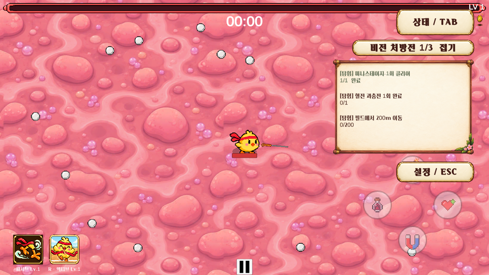
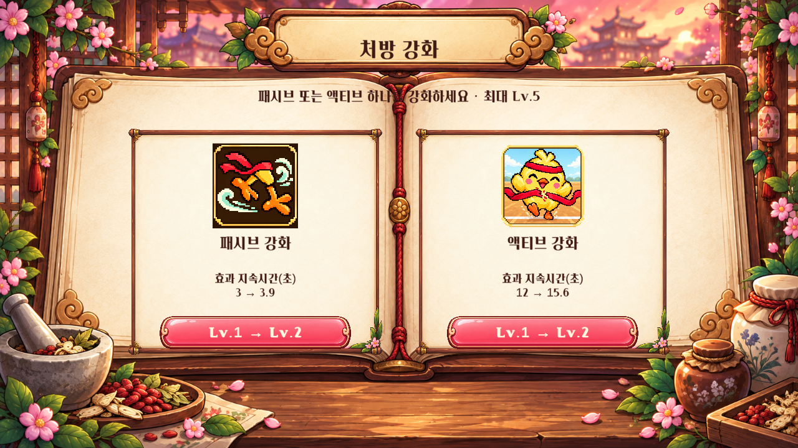
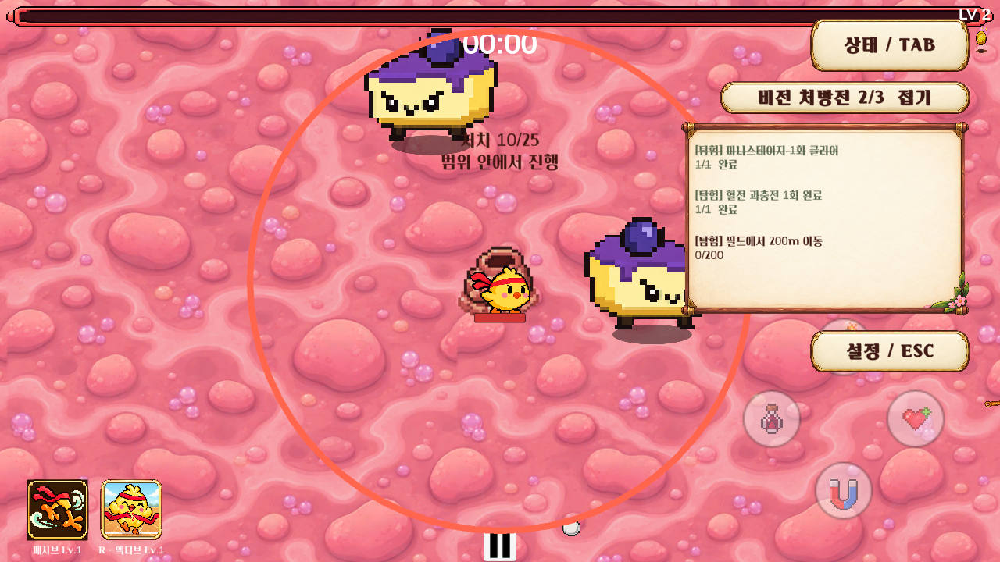
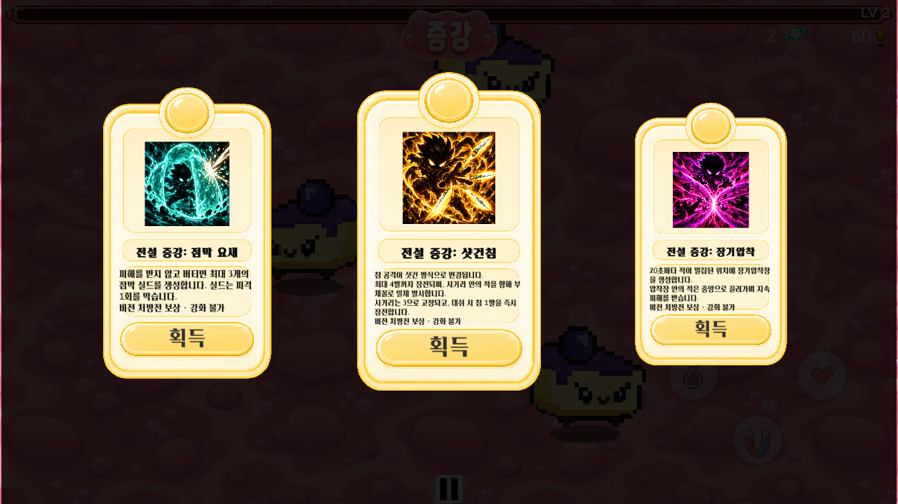

# 처방전·혈전 리메이크 (2026-10-01)

대상 브랜치: Junhan2. 사용자 확정 규칙에 따라 구현. 아래 숫자는 첫 적용 밸런스이며 장시간 플레이/휴대폰 실기기 밸런스 확정값은 아니다.

## 처방전

- 런마다 전투/탐험/스킬 중 **하나의 태그**를 정하고 그 태그의 후보 4개 중 서로 다른 3개 추첨. 태그별 하나씩 섞지 않는다.
- RemakeBalance.randomTagEachRun=true가 기본. false이면 designatedTag로 디자이너가 태그 고정 가능.
- TAB 안내 아래 접기/펼치기. 이름 없이 태그, 목표 문장, 숫자 진행도. 완료 문구 취소선 및 완료 표시.
- 세 목표 완료 후 버튼을 눌러 전설 3개 중 1개 선택. 한 런 1회. 기존 레벨업 선택창을 재사용하며 후보 중복을 제외한다.
- 미니보스/제산 거품의 자동 전설 상자 지급은 비활성화. 전설 수치 등급과 전설 능력 풀의 기존 구분은 유지.
- 퀘스트와 완료/수령 상태, 스킬 레벨은 기존 런 씬 전환 스냅샷에 포함한다. 별도 디스크 세이브 시스템을 추가한 것은 아니다.

| 태그 | 후보 목표 |
|---|---|
| 전투 | 몬스터 150마리 / 엘리트 1마리 / 15초 안에 20마리 / 액티브 중 25마리 처치 |
| 탐험 | 혈전 입구 1개 개방 / 과충전 1회 / 미니스테이지 1회 성공 / 필드 200m 이동 |
| 스킬 | 액티브 3회 사용 / 대시 8회 / 대시 후 3초 내 30마리 처치 / 액티브 효과 누적 20초 |

짧은 처치 구간은 최근 15초 이동 창으로 계산하며 완료 후 취소되지 않는다. 혈전 자체/비플레이어 처치/정지된 필드 몬스터 정리는 처치 목표에 포함하지 않는다. 방/씬 순간이동은 이동량에서 제외한다. 전설은 자동으로 전투를 끊지 않고 버튼으로 수령한다.

## 스킬 강화

- 기본 Lv.1 → 최대 Lv.5. 배율은 1 / 1.3 / 1.69 / 2.197 / 2.8561.
- 패시브/액티브 두 카드 중 하나. 최대 레벨 카드는 비활성. 모두 최대이면 최대 체력 20% 회복으로 대체하고 정상 귀환 가능.
- 동일 보상은 한 번만 선택 가능. 강화 선택 중 게임 정지 및 기존 일시정지 버튼으로 해제 방지.
- 스킬 HUD에 패시브/액티브 현재 레벨 표시. 증강 선택 중 HUD를 숨겨 카드와 설정 버튼이 겹치지 않게 한다. 전설 12종의 긴 설명도 카드 영역 안에 맞춘다.

| 캐릭터 | 패시브 강화 | 액티브 강화 |
|---|---|---|
| 아시 | 패시브 지속시간 ×배율 | 액티브 지속시간 ×배율 |
| 혁이 | 기본 즉시 빙결 확률 10% ×배율; 실패당 +1%p 유지, 최대 100% | 재사용 대기시간 ÷배율; 빙결 시간/보스 저항 유지 |
| 신이 | 장판이 부여하는 화상 피해 ×배율 | 토네이도 정산 피해 ×배율 |
| 아리 | 기본 구르기 접촉 피해 ×배율 | 변신 대시 접촉 피해 ×배율 |

일반 성공 보상은 스킬 강화. 상위 성공은 같은 강화 후 일반 레벨업 상자 1개 추가. 수집 방의 필드 골드/경험치 보상은 그대로 유지. 일반 미스터리 꽝은 실패 보상 없음, 몬스터 상자는 처치 성공 후 강화. 격화 미스터리는 모두 당첨이지만 한 상자만 선택하므로 스킬 강화 1회+추가 상자 1개.

## 과충전

- 혈전 파괴로 열린 입구에서 E로 즉시 일반 입장 또는 Q/터치 버튼으로 과충전 시작.
- 반경 2.5의 원형 표시, 처치형 25마리 / 체류형 누적 25초 중 입구마다 하나 추첨. 초기 4.5에서 실제 화면 확인 후 경계가 잘 보이도록 축소했다.
- 시간제한 없음. 원 밖은 초기화가 아니라 진행 정지. 처치형은 **플레이어만 원 안**이면 적 위치와 무관하게 인정.
- 시작 시 기존 엘리트 몬스터 1마리 합류. 기존 몬스터 풀/엘리트 Blueprint 사용.
- 입구 위에 현재/목표, 범위 밖 정지, 격화 완료 안내. 과충전 완료 전에도 일반 입장이 가능하며 해당 입구는 소비된다.
- 같은 입구 재시작/중복 정예 생성 불가. 미니스테이지/일시정지/사망 중 진행하지 않는다.

## 격화 패턴

| 방 | 격화 |
|---|---|
| 낙하 음식 | 착지 후 1.25초 원형 경고, 반경 1.35배, 낙하 피해의 60% 추가 폭발. 추가 기절 없음 |
| 자폭 돌진 | 매 4번째 개체 속도 1.2배, 주황색 구분. 풀 재사용 시 일반 속도/색상 복원 |
| 저격수 | 발사 후 0.2초 뒤 전체 재배치. 동시 발사 통합, 플레이어 3 이상 거리/개체 간격 고려. 재배치 후 조준부터 다시 시작 |
| 골드·경험치 | 방 진행/드롭 구성 그대로. 상위 공통 보상만 추가 |
| 미스터리 | 모두 당첨, 하나만 선택 |
| 위산 개체수·반사 퍼즐·소화액 유인 | 양 등급 스폰 후보 제외, 기존 자산은 보존 |

## 자산·검증

설정: Assets/Junhan/Resources/RemakeBalance.asset. 기존 한지 패널/책 배경/스킬 아이콘을 재사용하고 원형 경고는 런타임 선으로 그린다. 신규 생성 이미지나 외부 다운로드 자산은 필요하지 않았다.

회귀: PrescriptionRemakeTests(EditMode), PrescriptionRemakePlaySmoke(실제 Level 1 씬). 플레이 검사는 목표/스킬/과충전과 각 방의 핵심 연결을 가속·직접 호출해 검사하며 자연 플레이 전체를 대체하지 않는다. 최종 실행 결과는 검증 문서와 Notion 갱신에 기록한다.

## 실제 Unity 화면

자동 검사 중 실제 씬과 UI를 1280×720으로 렌더한 화면. 캐릭터 체력과 방 완료 조건은 검사 편의를 위해 조정된 상태다.

