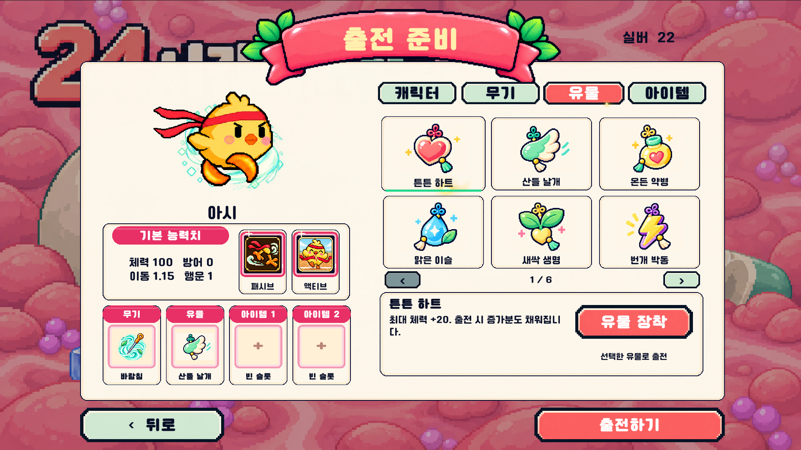

# 유물 34종 — 2026-10-05

출전 준비에서 유물 **1개**를 영구 해금 후 장착한다. 기존 3종의 ID와 해금 기록을 유지하고 31종을 추가했다. 해금 시 실버를 한 번 지불하며 매 출전마다 소비하지 않는다. 기존 3종의 효과 값은 유지하고 임시 가격 1은 아래 가격으로 정리했다. 이미 해금한 유물에는 추가 결제가 없다.

## 초기 밸런스 기준

현재 혁이 기본 체력 100·이동 수치 1.15, 일반 수치 증강·런 아이템 효과와 유물 1슬롯의 기회비용을 기준으로 정했다. 공격·공속은 약 10%, 치명타는 4~5%p, 관통·추가 탄환은 정수 단위다. 같은 계열인 노리개와 간식은 비용/강도로 구분하며, 구슬과 연근칩은 같은 성능의 외형 대안이다. 모두 첫 적용값이며 15분 완주 QA로 재조정한다.

[Brotato 아이템 목록](https://brotato.wiki.spellsandguns.com/Items)의 +5% 치명타, +10% 공격속도, +30% 수집 범위, 추가 관통 1 같은 단위를 비교했다. 해당 게임의 페널티·다중 장착·체력 체계는 이 게임과 다르므로 수치와 가격을 그대로 옮기지 않았다. 위키는 비교 참고 자료이며 이 게임의 확정 밸런스 근거로 취급하지 않는다.

## 목록

| 유물 | 효과 / 조건 | 해금 실버 |
|---|---|---:|
| 튼튼 하트 | 최대 체력 +20. 출전 시 증가분도 채워집니다. | 120 |
| 산들 날개 | 이동 속도 기본 수치 +0.2. | 160 |
| 온든 약병 | 회복 아이템의 체력 회복량 +25%. 자동 회복·흡혈에는 미적용. | 160 |
| 맑은 이슬 | 기절·이동 반전·장판 이탈 후 둔화 지속시간 -25%. 장판 내부와 함정 탈출 조건은 유지. | 180 |
| 새싹 생명 | 초당 체력 0.3 회복. 일시정지·사망 중에는 회복하지 않습니다. | 220 |
| 번개 박동 | 공격 속도 +10%. 액티브 재사용 시간은 바뀌지 않습니다. | 220 |
| 단단 방패 | 받는 피해 -8%p. 다른 피해 감소와 합산하며 최대 80%. | 180 |
| 반짝 급소 | 치명타 확률 +5%p. 최대 100%. | 160 |
| 쏙쏙 자석 | 아이템 자동 획득 반경 +30%. | 140 |
| 팡팡 구슬 | 발사체 수 +1. 발사체 수를 지원하는 공격에 적용. | 450 |
| 배움 두루마리 | 경험치 획득량 +10%. | 220 |
| 복복 주머니 | 런 골드 획득량 +15%. 소수점은 누적하며 로비 실버에는 미적용. | 180 |
| 힘찬 망치 | 공격력 +12%. 플레이어 공격력 배율을 사용하는 피해에 적용. | 220 |
| 꿰뚫는 화살 | 침의 일반 몬스터 관통 +1. 관통 증강 없이도 적용. 보스 파츠 관통은 별도. | 300 |
| 통통 도토리 | 침이 적중한 뒤 도탄 +1. 가까운 아직 맞지 않은 적을 우선 추적. | 350 |
| 활짝 부채 | 공격 범위·침 크기 +15%. 침의 폭발·위산 장판 반경에도 적용. | 220 |
| 오래 모래시계 | 침이 남기는 상태이상·잔류 공격 지속시간 +20%. 액티브·무적 시간에는 미적용. | 220 |
| 콩콩 방울 | 침의 적 밀치기 +25%. 보스의 밀치기 면역은 유지. | 140 |
| 살랑 깃털 | 회피 확률 +6%p. 다른 회피와 합산하며 최대 80%. | 200 |
| 포근 우산 | 피격 후 무적 +0.2초. 기본 0.5초에서 0.7초로 증가. | 220 |
| 도톰 붕대 | 피해 흡수 보호막 최대 +20. 출전 시 충전. 8초간 피격하지 않으면 초당 5 재충전. | 260 |
| 다시 꽃봉오리 | 한 판에 한 번 쓰러질 때 최대 체력 50%로 부활. 씬 이동으로 재충전되지 않음. | 600 |
| 따끔 밤송이 | 실제 잃은 체력의 50%를 반경 2.5 안의 적에게 반사. 0.5초 간격·1회 최대 50. | 220 |
| 꿀잠 베개 | 1.5초간 자발적으로 정지하면 초당 최대 체력 1% 회복. 속박·기절 중에는 미적용. | 220 |
| 반짝 침통 | 침의 일반 몬스터 관통 +2. 관통 증강 없이도 적용. 보스 파츠 관통은 별도. | 450 |
| 정갈 약저울 | 런 상점 아이템 가격 -15% (올림). 실버 해금·출전 아이템·새로고침 비용은 유지. | 240 |
| 탱글 홍삼젤리 | 캐릭터 기본 최대 체력 +25%. 출전 시 증가분도 채워집니다. | 240 |
| 상큼 귤조각 | 캐릭터 기본 이동 속도 수치 +12%. | 140 |
| 고소 호두 | 받는 피해 -6%p. 다른 피해 감소와 합산하며 최대 80%. | 120 |
| 달콤 꿀떡 | 피해 흡수 보호막 최대 +15. 출전 시 충전. 8초간 피격하지 않으면 초당 5 재충전. | 180 |
| 바삭 연근칩 | 발사체 수 +1. 발사체 수를 지원하는 공격에 적용. | 450 |
| 시원 박하캔디 | 침 적중 시 둔화 확률 +15%p. 3초 동안 40% 감속. 빙결과 별도. | 180 |
| 톡톡 오미자 | 치명타 확률 +4%p. 최대 100%. | 120 |
| 따끈 생강차 | 기절·이동 반전·장판 이탈 후 둔화 지속시간 -20%. 장판 내부와 함정 탈출 조건은 유지. | 120 |

## 계산·안전 규칙

- 일반 능력치와 같은 축은 합산한다. 치명타·둔화 발동 확률은 100%, 받는 피해 감소·회피는 기존 상한 80%. 피해 감소는 방어력 처리 후 적용한다.
- 보호막은 점막 요새의 1회 차단과 별개인 HP형 피해 흡수다. 1회 차단 효과를 먼저 처리하고, 남은 피해를 방어/감소 → 보호막 → 체력 순서로 적용한다. 체력바 위쪽 2px 하늘색 선은 잔여 보호막 비율이다.
- 부활은 소모 상태를 런 상태에 저장한다. 씬 이동/미니스테이지 진입으로 보호막을 가득 채우거나 부활을 복구하지 않는다.
- 회복 아이템 강화는 체력 회복 수집물과 빨간 물약에만 적용한다. 자동 회복·흡혈·부활에는 곱하지 않는다. 기존 회복 아이템 증폭과는 곱연산.
- 상태이상 저항은 이동 반전·기절·유한 함정 속박 시간과 달팽이 장판의 이탈 후 둔화에 적용한다. 장판 위에 서 있는 동안, 무기 공격으로 탈출해야 하는 함정, 적의 행동 시간에는 영향 없음.
- 정지 회복은 실제 이동 입력 없음·속도 0.1 미만·대기 상태가 1.5초 지속될 때만 발동. 대쉬·속박·기절·일시정지·사망에서는 진행하지 않는다.
- 반사 피해는 실제 체력 손실 기준, 0.5초 내부 간격·반경 2.5·대상별 최대 50. 같은 적의 여러 콜라이더로 중복 피해를 주지 않으며 반사가 다시 반사를 일으키지 않는다.
- 관통/도탄은 현재 침 발사 경로에 연결한다. 관통 증강 없이도 유물의 관통이 작동하지만 보스 다중 파츠 관통은 기존 별도 규칙을 유지한다. 추가 탄환은 해당 능력이 발사체 수를 지원할 때 적용한다.
- 지속시간 유물은 침의 상태이상·잔류 장판에 적용하며 액티브 지속·쿨타임·피격 무적은 늘리지 않는다. 범위는 침 크기/사거리 및 침 폭발·위산 장판 반경에 적용한다.
- 골드는 기존 소수점 누적 계산을 사용한다. 상점 할인은 런 아이템 가격만 올림 계산하며 최소 1G. 로비 실버·새로고침 비용은 변경하지 않는다.
- 유물 능력치는 기본 값에 읽기 시 합산하므로 Start 순서·씬 복원으로 중복 더하지 않는다. 새 디스크 런 저장/계정 동기화를 추가한 작업은 아니다.

## 이미지

첨부 PNG 6장을 [원본 그대로 저장](../../Assets/Resources/RelicCatalog/)하고, 유니티 스프라이트 사각형으로 아이콘 부분만 참조한다. 원본 픽셀·색·윤곽·장식과 크림색 바탕을 유지하며 제목·카드 테두리는 선택 영역에서 제외한다. 생성 AI로 다시 그리거나 임시 아이콘으로 바꾸지 않았다.

데이터 원본: [catalog.json](../../Tools/Relics/catalog.json). 재설치 메뉴: Tools / 24tu / Install reviewed relic catalog. 기존 October 아트 설치기가 새 유물 이름·아이콘을 덮어쓰지 않게 보호했다.

## 검증

관련 자동 검사: `Vampire.Tests.Editor.RelicCatalogSmoke.Run`. Unity 2022.3.62f3의 실제 Main Menu/Level 1에서 **197개 검사 통과**, 에러/예외 0. 34종 데이터·6페이지 실제 UI·34종 전체 설명 영역·효과별 계산·기존 저장 ID·관통·할인가·보호막·부활 소비·캐릭터 스냅샷 복원을 검사했다.

- 실제 피격 25에 보호막 20을 소모한 뒤 HP 5 감소. 8초 재충전 대기와 이후 초당 5 회복 확인.
- 정지 1.5초 이후에만 회복, 기절/정지 시간에는 회복 없음. 자동 회복 초당 0.3 확인.
- 한 몬스터의 두 콜라이더에 반사가 한 번만 적중, 0.5초 간격·최대 피해 50 확인.
- 치명적 피해에서 HP 50%로 부활, 소모 상태가 캐릭터 스냅샷 복원 뒤에도 유지됨을 확인.
- 검사 중 임시로 변경한 유물 해금/장착 PlayerPrefs는 완료 시 원래 값으로 복원.
- 기존 EditMode 자동 테스트 **74/74 통과**(실패/건너뜀 0).

[공격 유물](QA/catalog-2.png) · [생존 유물](QA/catalog-3.png) · [추가·간식 유물](QA/catalog-4.png) · [간식 유물 2](QA/catalog-5.png)

장시간 자연 플레이·모바일 실기기·설치본 업데이트는 별도 QA다.

## 함께 정리한 이전 업데이트

- `40e4591`: 특수 무기·이벤트·몬스터 최초 발견 튜토리얼. 콘텐츠별 한 번, 로컬 영구 저장, 크림 카드·검정 반투명 배경·일시정지·혁이 동작 예시.
- `dbbd353`, `b2eb5d9`: 혈전 최초 스폰 설명, 처치 → 포탈 → E → 미니스테이지 동작 예시와 Q 과충전·상위 난도/보상 안내. 예시는 실제 자산 기반 연출이지 플레이 녹화 영상은 아니다.
- `8d669d8`: 죠스바 등 그림자 위치·크기 보정. 자폭 몬스터·도넛의 공중 간격은 유지. 25개 외형과 방향·애니메이션·풀 재사용 검증.

[첫 발견 튜토리얼 상세](../TutorialUI/Implementation.md) · [그림자 보정 상세](../MonsterShadowAlignment.md)
