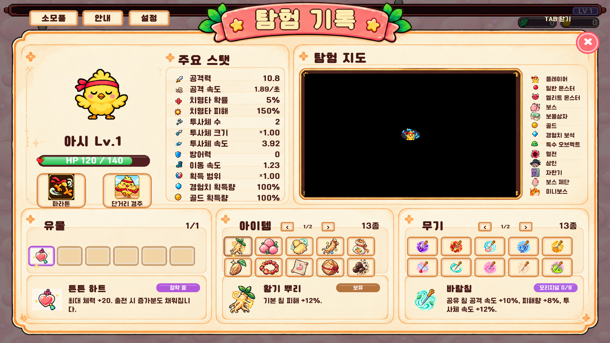

# TAB · 탐험 기록

2026-10-08 승인 시안의 크림색 패널·산호 리본·상단 캐릭터/스탯/지도·하단 유물/아이템/무기 구성을 적용했다. 시안의 ‘도감’ 자리는 **무기**로 바꿨다. 게임 뒤에는 전체 화면 검정 68% 반투명 배경을 사용한다.

## 실제 데이터와 조작

- 캐릭터 외형·이름·레벨·현재/최대 HP, 패시브/액티브 아이콘은 현재 플레이어 기준. 두 스킬 버튼은 설명만 열며 스킬을 사용하지 않는다.
- 공격력·공격 속도(초당)·투사체 수/속도/크기는 실제 침의 계산값. 치명타·방어·이동·경험치·골드·획득 범위 배율은 현재 캐릭터/유물/일반 증강 상태를 사용한다. 대상별 조건부 추가 피해나 확률 발동을 기본 공격력에 합산하지 않는다.
- 유물은 현재 런의 실제 장착 유물. 시안의 장식 칸은 유지하지만 기존 1개 장착 규칙을 바꾸지 않으며 `1/1`처럼 실제 수량을 표시한다.
- 아이템은 이번 런에 획득한 아이템. 무기는 실제 소유한 특수 침과 고귀 증강이며, 특수 침이 없으면 기본 침을 표시한다. 해금만 했거나 보상 후보로 제시된 무기는 표시하지 않는다.
- 각 목록은 독립적으로 선택된다. 선택한 오브젝트의 아이콘·이름·상태·설명은 해당 하단 칸에 표시되고 다른 목록의 선택은 유지된다. 긴 설명은 그 칸 안에서 스크롤한다.
- 무기 설명에는 해당 특수 효과와 획득한 오리지널 횟수/효과, 누적 수치 강화가 포함된다. 읽기 과정에서 증강 후보를 추첨하거나 런 상태를 변경하지 않는다.
- 한 페이지에 유물6칸, 아이템/무기 각10칸. 초과 목록은 제목 옆 페이지 버튼으로 전부 확인한다. 빈 칸은 클릭되지 않는다. 선택·호버·키보드 포커스에는 기존 금빛 회전 효과를 재사용하며 일시정지 중에도 동작한다. 모션 줄이기 설정은 존중한다.
- 닫기/TAB은 원래 일시정지 상태로 돌아간다. 레벨업 보상 중 열었으면 닫아도 보상 선택과 정지가 유지된다. 설정·소모품 설명·안내 다시 보기도 유지했다.

## 지도

기존 탐험 텍스처·탐험 안개·확대 UV와 발견된 마커를 그대로 사용한다. 승인 시안의 예시 지형은 게임 지도로 고정하지 않는다. 탐험하지 않은 구역은 검정색이다. 지도 영역에서 마커를 잘라 표시하고, 현재 탐험 영역의 일반/엘리트 몬스터·골드·경험치 보석도 스냅샷으로 표시한다. 과밀 표시를 막기 위해 보조 점은 몬스터160·골드60·경험치60개 상한이며 기존 보스/상인/혈전 마커에는 이 상한을 적용하지 않는다.

오른쪽 범례13종: 플레이어, 일반 몬스터, 엘리트 몬스터, 보스, 보물상자, 골드, 경험치 보석, 특수 오브젝트, 혈전, 상인, 자판기, 보스 제단, 미니보스. 기존 아이콘을 재사용하고 없는 아이콘은 승인 시안의 외형에 맞춰 제작했다. 특수 오브젝트 기본 마커도 같은 아이콘으로 연결했다.

## 자산

빌트인 `image_gen`으로 시안 기반 빈 패널 `Assets/Resources/RunBook/Backplate.png`와 스탯/범례16개 아틀라스 `Assets/Resources/RunBook/Icons.png`를 제작했다. PNG를 재인코딩·리사이즈·압축하지 않았으며 생성 원본과 동일하다. Unity 임포트도 무압축, mipmap 없음, NPOT 크기 유지. 아이콘은 런타임 Sprite 영역으로 분리한다. 아래 프롬프트와 `Artwork.json`에 생성 원본·SHA-256을 기록했다.

### Backplate prompt

Use case: precise-object-edit. Create a production game UI BACKPLATE asset from the supplied approved UI mockup. Preserve its exact wide 16:9 layout, cream paper texture, warm thin gold/orange borders, rounded ornate corners, large blank coral ribbon with green leaves and two yellow stars at top center, main panel and internal compartment boundaries at the same relative positions. Remove ALL text/numbers/letters, character, icons, inventory objects, hp gauge, buttons, slot squares, map terrain and markers. Keep the large panels: top left character area next to stats area, top right map area with empty right legend margin, bottom three equal sections each including its empty description box below. Keep map inner ornate rectangular gold frame but make its interior dark warm brown, empty. Remove the coral close button; it will be a real UI button. Bottom relic description begins a little higher than item/weapon descriptions exactly as reference. Everything behind outer panel and ribbon is actual transparent alpha, no game world. Flat front orthographic artwork, no perspective. This is a reusable blank skin, not a mockup screenshot. Preserve ornamental accents and paper shading; leave all content areas empty for code-rendered live UI. High resolution landscape 16:9.

### Icon prompt

Create a production transparent UI ICON ATLAS matching the small cute hand-drawn warm dark-brown-outlined colorful icons in the reference, NOT pixelated and no text. Exactly 16 distinct isolated icons in a uniform 4 column by 4 row square grid. Each cell equal 256x256, icon centered with generous 40px empty margin. No panels, no shadows outside object, no labels. Row1 left to right: silver sword attack icon; small beige curled wind attack-speed icon; red four-petal critical-chance flower; gold orange eight-point critical-damage star. Row2: three small blue darts projectile-count; a single blue dart with larger arrowhead projectile-size; blue dart with motion streaks projectile-speed; blue shield armor. Row3: blue boot move-speed; red and blue horseshoe magnet pickup-range; blue XP experience jewel (no letters); gold coin gold-gain. Row4: tiny glossy red orb normal-enemy; cute pink round horned elite monster face; cyan diamond experience gem; small cute green slime/blob special-object. Use the reference icon silhouettes and saturation. Real transparent background throughout. Identical visual footprint, no overlapping cells. 1024x1024.

## 검증·범위

Unity 2022.3.62f3 실제 Level 1에서 `Vampire.Editor.RunBookSmoke.Run` 검사 **107개 통과**. 실제 UI 클릭 판정, 세 목록의 독립 선택, 페이지 이동, 누적 무기 강화 설명, 긴 설명 스크롤, 금빛 효과, 게임 정지·복귀, 레벨업 보상 중 열기·닫기, 창 크기 변경 후 닫기 버튼을 확인했다. 기존 `Vampire.Editor.ReadOnlyHelpSmoke.Run` 도움말 회귀 검사도 **30개 통과**했다.

QA 캡처는 아이템과 무기를 강제로 지급한 검사 화면이며 자연 플레이 획득 상황이 아니다. 캡처 해상도는 1920×1080이며 모바일 및 여러 화면 비율 검증은 이번 범위에 포함하지 않았다.

- [긴 설명 스크롤](QA/description-scroll.png)
- [다음 페이지 선택](QA/next-page.png)

공유 링크·공개 PC/모바일 빌드·공개 서버 설정은 변경하지 않는다. 이번 작업은 Junhan2 PC 개발 테스트용이다.
