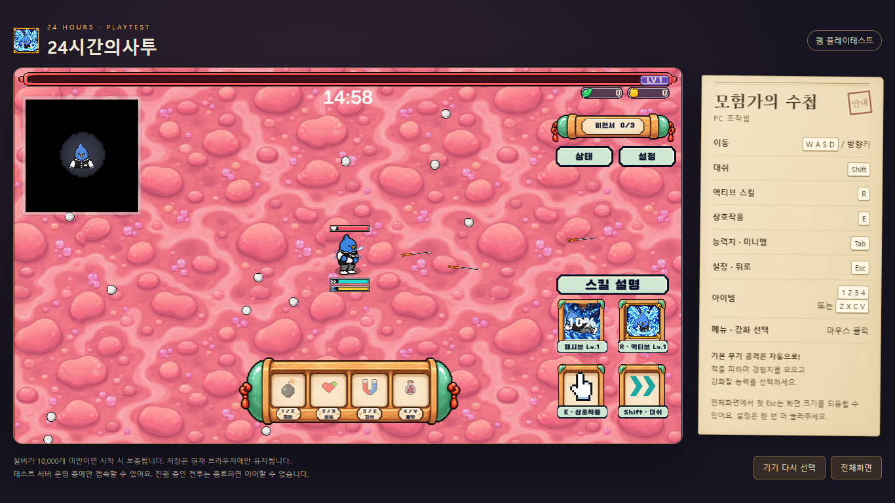
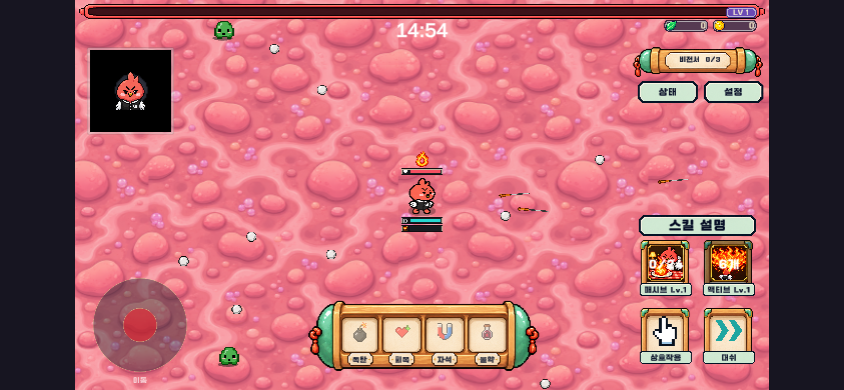
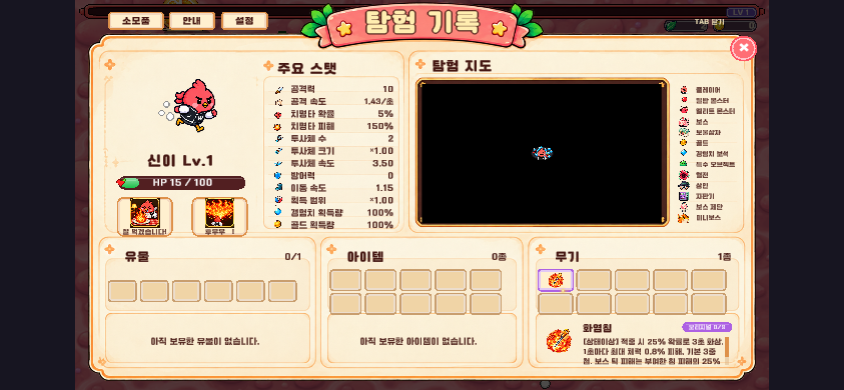
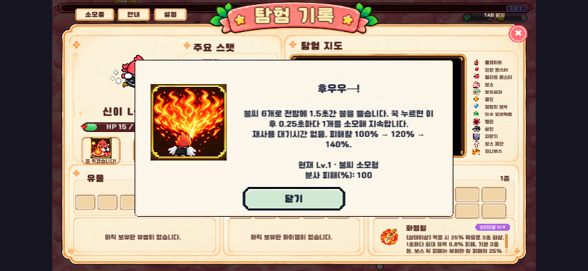

# 2026-10-09 스테이지 1 웹 공개판

최신 Junhan2의 캐릭터·스킬·증강·카멜레온·탐험 기록을 PC와 모바일 웹에 반영한다. 공개판은 스테이지 1 최종 보스 처치 후 승리 결과로 종료한다. 개발판의 스테이지 2 및 원본 이미지와 기존 임포트 설정은 보존한다.

## 공개 범위

- 신이 `잘 먹겠습니다!` / `후우우—!`: 불씨 69% 드롭, 보유 24/30/36, 최초 6개, 1.5초 분사, 이후 유지 0.25초당 1개. 불꽃 숫자·승인 아이콘·가슴 팽창·연속 부채꼴 루프 포함.
- 신이 레벨업 보상 선택 중 입력과 연료 시간 보존, 실제 해제 추적, 분사 중 현재 시선으로 자세·불꽃·피해 범위 회전.
- 아시 바람 봉황과 쿨타임 강화, 아리 지속시간 강화, 혁이 상태이상 추가 피해와 모든 캐릭터의 빙결침 실패 보정.
- 활성 특수 19종과 오리지날 57종, 목침/꿀침 획득 차단, 유한 중첩 상한, 완성 부모 전설 70/지존 30, 과충전 상자 오리지날 최소 1개와 새로고침 보장.
- 카멜레온 4종 HP 2500·이동 0.8, 최신 필드 연출과 TAB 탐험 기록. 기존 모바일 조이스틱·함정·상자·설명·최대 보유량 수정 유지.
- 스테이지 1 최종 보스 HP 24,000 유지. 스테이지 2 진입과 보상 크레이터, 전용 달팽이·휘핑크림 배경·설정 자산은 공개판에서 제외.

## 빌드 분리와 압축 호환

`PROJECT_GC_STAGE_ONE_ONLY=1` 환경변수로 `WebDemoBuild.Run`을 호출한다. 플레이어에만 동명의 정의를 전달하므로 일반 개발 실행에서는 스테이지 2가 유지된다. `StageProgression`은 공개판에서 스테이지 2 정의를 로드하지 않고 보스 호출자에게 기존 승리 흐름을 반환한다.

`WebDemoStageScope`는 스테이지 2 Resources를 임시 Editor 폴더로 이동하고 공용 `VisibleBodyGeometry`의 해당 참조만 제거한다. 빌드 전 의존성과 최종 BuildReport 포함 자산을 모두 검사한다. 실패 시에도 저널을 통해 원본 자산과 공용 카탈로그 바이트를 복원한다. 중단 복구 메뉴는 `24투/Restore web build Stage 2 resources`다.

PC는 DXT, iPhone/Android 공통 모바일은 ASTC 4×4 및 Gzip을 사용한다. `WebDemoTextureScope`는 원본 PNG를 수정하거나 크기를 줄이지 않고 빌드용 임포트 설정을 적용한 후 기존 로컬 편집까지 복구한다. 모바일 로더는 기존 단일 디코딩 버퍼와 브라우저 압축 해제 경로를 유지한다.

카멜레온은 압축 또는 CPU 읽기 불가 텍스처에 `GetPixels32/GetPixel`을 호출하지 않는다. `ChameleonMeshBake`가 원본 PNG에서 64자세의 기존 외곽 메시와 알파 피격 비트 마스크를 생성한다. 실행 중에는 저장된 메시와 마스크를 사용한다. 외곽·피벗·크기와 순간이동의 알파 기준을 보존한다. JSON 직렬화와 모든 원본 픽셀 대조, 경계 밖 판정도 확인한다.

## 검증 기록

- 변경 후 `ChameleonMeshBake.RunSmoke`: 원본 외곽/피격 마스크 64개 검증, 실제 Level 1 회귀 132개 통과.
- 모바일 메모리 로더 검사 10개와 셸 검사 17개 통과.
- 기존 스킬 검증: 4909a48의 신이 PlayMode 90개와 Windows 실행 13개. 이번 브라우저 검사 수에 합산하지 않는다.
- 자연 15분 완주와 iPhone/Android 실기기 성능·발열·터치는 별도 QA 범위다. Chromium 터치 에뮬레이션은 실제 Safari 검증을 대신하지 않는다.

최종 PC·모바일 빌드 모두 성공했다. 두 빌드의 의존성/포함 자산 검사에서 스테이지 2 전용 자산이 없고, 생성된 실행 코드의 `StageTwoEnabled`가 false임을 확인했다. 471개 원래 텍스처 임포트와 공용 몸 외곽 카탈로그를 저장 바이트와 대조해 복구를 확인했으며, 스테이지 2 개발 자산도 원래 경로에 돌아왔다.

서버 검사 16개, 기기 선택 화면 검사 48개 통과. 실제 PC/Android/iPhone 경로로 압축된 Unity 빌드를 로드하고 로비·출전 준비·스테이지 1 전투·설정 진입을 확인했다. 모바일은 Chromium 터치 에뮬레이션이다. 별도 신이 모바일 실행에서 승인 아이콘·머리 위 불꽃 숫자·탐험 기록·무기 상세·액티브 설명창도 확인했다. 새로운 브라우저/Unity 예외는 없었으며 기존 지도 미연결 스크립트 경고 2개는 남아 있다.

상세 로그와 캡처는 `D:/Project_GC/work/Stage1Release-20261009`에 보관한다. 실행 검사는 `Tools/Distribution/Test-WebPortalGame.cjs`로 재현하며 `PROJECT_GC_QA_MODES=pc` 또는 `iphone,android`로 범위를 나눌 수 있다.

## 공개 서버

- 플레이: https://prices-object-played-archive.trycloudflare.com
- PC: `Builds/WebDemo-PC-20261009-stage1-r2`
- 모바일: `Builds/WebDemo-Mobile-20261009-stage1-r2`
- 선택 화면: `Builds/WebPortal-20261009-stage1/portal`
- 배포 식별자: `4909a48-stage1-20261009-r2`. 게임 변경 기준 4909a48에 이번 스테이지 분리/압축 호환 수정을 더한 빌드다. 기존 로컬 이미지 임포트 편집을 보존해 `localChangesIncluded=true`로 기록한다.
- PC DXT 빌드 보고 크기 520,100,148바이트, 모바일 ASTC 324,722,725바이트. 모바일 첫 다운로드 안내 325MB.
- 외부 주소에서 입구/PC/Android/iPhone HTTP 200, 두 manifest의 스테이지 1 범위, 실제 빌드 파일 8개와 모바일 Gzip 헤더를 확인했다.
- 외부 주소의 iPhone 버튼 → 모바일 페이지 → 실제 압축 게임 다운로드 → Unity 로비까지 확인했고 새 예외는 없었다. 이것도 Chromium 터치 에뮬레이션이며 실물 Safari 검사가 아니다.
- 배포 압축 묶음은 `Builds/Packages/24tu-Stage1-PC-20261009.zip`과 `Builds/Packages/24tu-Stage1-Mobile-20261009.zip`에 생성하며 ZIP CRC 검사로 확인한다.

공유 PC와 네트워크가 유지되는 동안 접속할 수 있는 임시 주소다. 이전 정상 PC/모바일 빌드와 설정 백업은 롤백용으로 유지한다. 재시작은 `D:/Project_GC/work/PublicWebDemo/Share-WebDemo.ps1 -Action Start -NoOpen`을 사용한다.






## 재빌드

Unity 2022.3.62f3 WebGL 모듈을 사용한다. 각 빌드를 별도 빈 폴더로 생성하고 Unity 종료 및 원본 복원이 끝난 뒤 다음 프로필을 만든다.

```powershell
$env:PROJECT_GC_STAGE_ONE_ONLY='1'
$env:PROJECT_GC_WEB_MOBILE='1' # PC는 0
$env:PROJECT_GC_WEB_OUTPUT='D:/Project_GC/Project_GC/Builds/<새 빌드 폴더>'
$env:PROJECT_GC_SOURCE_COMMIT='<빌드 소스 커밋>'
& 'C:/Program Files/Unity/Hub/Editor/2022.3.62f3/Editor/Unity.exe' -batchmode -buildTarget WebGL -projectPath 'D:/Project_GC/Project_GC' -executeMethod Vampire.Editor.WebDemoBuild.Run -logFile '<로그 경로>'
```

PC/모바일 빌드를 `Prepare-WebPortal.cjs`로 묶고 `Verify-WebDemo.cjs`, 서버/선택 화면/실제 게임 검증을 거쳐 `work/PublicWebDemo/active-build.json`을 전환한다. 이전 정상 빌드는 롤백과 기존 해시 요청용으로 유지한다. 실패한 후보 빌드는 서비스 경로에 넣지 않는다.

기존 임시 Cloudflare 주소는 이미 종료되어 새 터널 주소가 필요하다. 기기 선택 입구와 `/play-pc.html?embed=1`, `/mobile/?device=iphone`, `/mobile/?device=android` 경로는 유지한다. 새 도메인은 브라우저 저장 영역이 다르므로 이전 주소의 저장이 자동 이전되지는 않는다.
