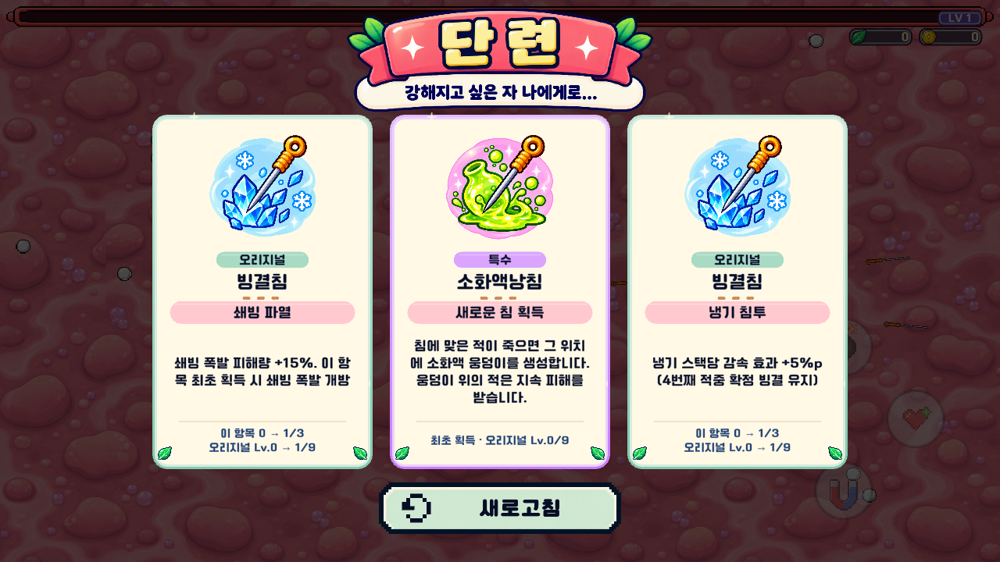
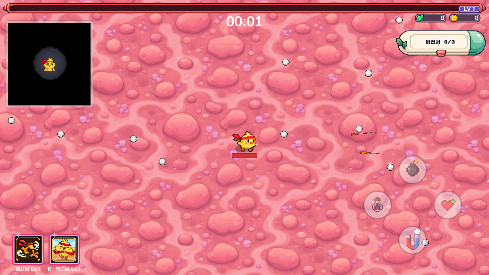
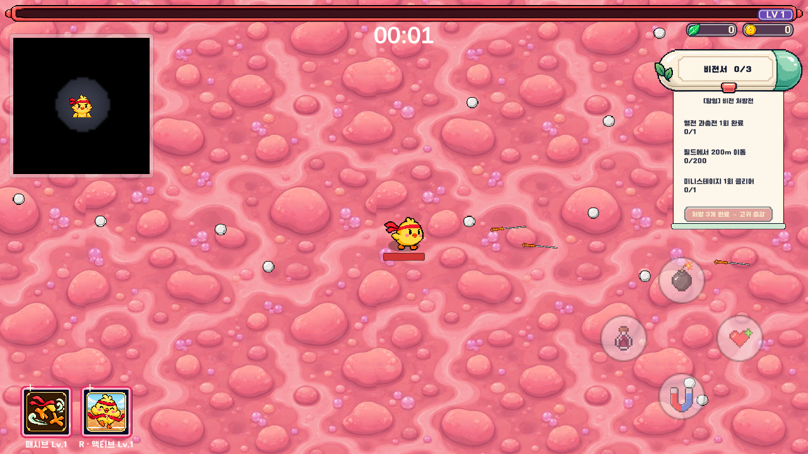

# 단련 화면 · 침 아이콘 · 비전서 크기 정리

2026-10-02

## 반영 내용

- 단련 제목, 분홍 띠, 잎 장식, 부제 배경을 한 장의 투명 이미지로 통합했습니다. 글자를 별도로 겹쳐 표시하지 않습니다.
- 증강 카드에 공통 크림색 바탕, 등급별 광택 테두리, 둥근 등급 표시, 분홍 효과명 띠, 하단 강화 진행도를 적용했습니다.
- 효과 수치와 설명을 유지하면서 긴 획득 설명까지 카드 안에서 자동 줄바꿈합니다. 무기 21종의 획득 설명과 오리지널 강화 63개를 검사했습니다.
- 빙결침을 기준으로 기본침과 특수침 21종, 총 22종의 금색 침 방향·배치·비례를 통일했습니다. 기존 스프라이트 GUID를 유지해 출전준비와 증강이 같은 이미지를 사용합니다.
- 경험치바 옆 레벨·처치 수·골드를 새 배지와 잎·코인 아이콘으로 표시합니다. 기존 집계 텍스트를 연결해 실제 수치 갱신은 그대로 동작합니다.
- 단련 카드, 새로고침, HUD, 출전준비 등 Apothecary UI에 카페24 써라운드 글꼴을 적용했습니다. 비동기 언어 글꼴 갱신이 카드의 새 글꼴을 덮어쓰지 않게 했습니다.
- 고귀 증강 11종은 기존 이미지·글꼴·제목 위치를 유지합니다. 일반 카드로 재사용되면 새 단련 디자인으로 돌아옵니다.
- 비전서 캡슐의 현재 외형과 오른쪽 상단 고정을 유지하고 전체 크기를 **0.7배**로 줄였습니다. 펼쳐지는 목록과 클릭 영역도 동일한 비율을 따릅니다. 펼치기·접기와 고귀 보상 수령 규칙은 유지합니다.

## 확인 화면

단련 시안 비교용 화면의 3개 카드는 검사 코드가 배치한 예시입니다. 실제 플레이의 선택지는 기존 증강 풀과 확률을 사용합니다.

## 글꼴과 제작 파일

- [카페24 공식 폰트](https://fonts.cafe24.com/)의 Cafe24 Ssurround v2.0을 사용했습니다.
- 게임에 포함된 원본: `Assets/Resources/TrainingUI/Cafe24Ssurround.ttf`
- 배포 라이선스: `Assets/Fonts/License-Ssurround.pdf` (SIL Open Font License 1.1). 원본 배포본의 라이선스를 함께 보관합니다.
- [이미지별 최종 프롬프트와 저장 경로](Artwork.md). 기본 제공 imagegen 도구로 제작했습니다.
- Unity 임포트 재현: `Vampire.EditorTools.TrainingUIInstaller.Install`
- UI 실행 검사: `Vampire.Tests.Editor.AugmentPanelPlaySmoke.Run`

## 검증

- Unity 2022.3.62f3 실제 게임 실행 검사 583개 통과.
- 출전준비·HUD·비전서 등 연결 기능 검사 177개 통과.
- EditMode 자동 검사 68개 통과, 실패·건너뜀 0개.
- Windows 64비트 Development 빌드 성공, 빌드 오류 0개.
- 1280×720 / 1024×768 / 1560×720에서 카드 겹침, 클릭 영역, 새로고침 위치 확인.
- 새로고침 1회 제한, 획득 후 일시정지 해제, 고귀 카드 재사용, 비전서 70% 축소 후 열기·닫기 확인.
